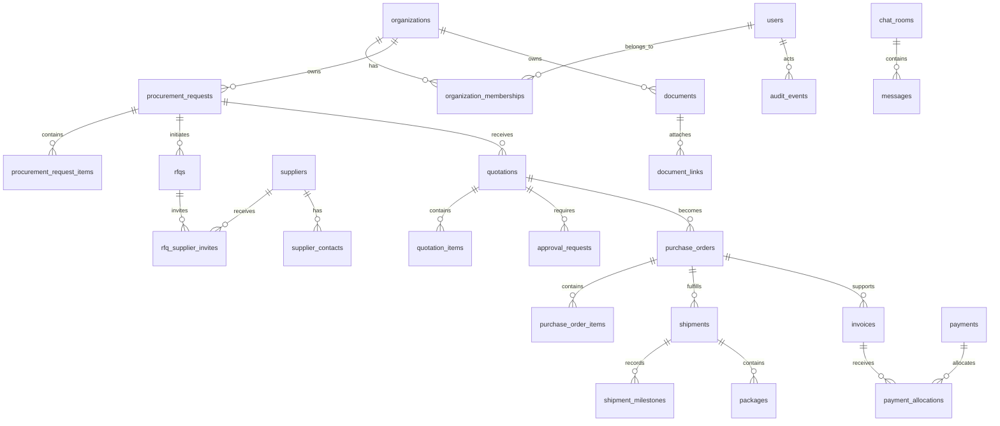

# HAMD Genesis - Enterprise Database Architecture

**Target:** PostgreSQL with Prisma  
**Scope:** Production relational architecture for HAMD procurement, logistics,
content, communications, and platform administration.  
**Constraint:** This is architecture only. It deliberately does not provide a
Prisma schema file or source code.

## 1. Decision summary

HAMD must not migrate its existing MySQL tables one-for-one. The current model
is a customer portal schema incrementally created from application startup code;
it is not an enterprise procurement data model. The target is a new,
tenant-aware PostgreSQL schema organized by bounded domain, with Prisma Migrate
as the only schema authority.

The migration strategy is **parallel rebuild and controlled data migration**:

1. discover and reconcile the actual live MySQL schema;
2. build the target PostgreSQL model;
3. map/import valid legacy data into bounded domains;
4. reconcile counts/relationships;
5. dual-read or cut over through a tested release plan;
6. preserve legacy data read-only for audit/recovery until retention permits
   retirement.

## 2. Existing architecture audit

### Current strengths

The existing backend has basic users, categories, products, `orders`, tracking,
chat, announcements, FAQs, notifications, and AI knowledge. It establishes a
useful starting record set, but not the relationships or controls needed for
enterprise procurement.

### Duplicate responsibilities and naming drift

- `orders` is simultaneously a procurement request and an order, exposed by
  both `orders` and `requests` routes with different persisted fields.
- `products` exists while `services` is used by routes but has no canonical
  table definition.
- `budget` and `budget_amount`/`budget_currency` overlap; delivery address
  naming varies between `delivery_zipcode` and `delivery_zip_code`.
- `company_type` and camel-case `companyType` diverge; user presence has both
  `last_seen` and `last_active_at`.
- Announcement counters are maintained both as row columns and through related
  event tables/triggers, inviting drift.
- Statuses differ across `orders.status`, API validation, and free-text
  `order_tracking.status`.

### Relationship and normalization problems

- One `orders` row contains a product/quantity/title, preventing a normal
  multi-line procurement request.
- Files, gallery, specifications, chat forms, and other queryable entities are
  JSON blobs rather than controlled children.
- Addresses are repeated across user and request columns with no durable
  snapshot/ownership model.
- No organization tenant boundary, team, cost center, approval, supplier,
  RFQ, quote, PO, invoice, payment allocation, shipment/package, document, or
  audit model exists.
- `categories.parent_id` has no self-FK; several route-referenced columns do
  not exist in canonical DDL.

### Security and operations problems

- Raw SQL and inline initialization/migrations have no single schema authority.
- The migration runner can continue after errors, allowing hidden environment
  drift.
- Hard-coded administrator user IDs and a two-value user role model cannot
  express enterprise authorization.
- Password-reset tokens are stored directly, hard deletes remove useful
  history, and no immutable audit trail exists.

## 3. Global data standards

### Naming

- PostgreSQL schema: `public` for primary transactional tables initially;
  separate reporting/search schemas only when operationally justified.
- Tables/plural model names use `snake_case`: `procurement_requests`,
  `quotation_items`.
- Primary key: `id`; foreign keys: `{related_singular}_id`.
- Time: `{event}_at`, stored as `timestamptz` in UTC.
- Money: `{amount}`, `{currency_code}`; never floating-point for money.
- Boolean: `is_` / `has_`; status fields use a constrained enum or controlled
  lookup where extensibility is required.
- Avoid generic `data`, `metadata`, and `files` blobs unless the document
  explicitly defines a validated JSONB shape and query/index strategy.

### UUID strategy

All primary business entities use database-generated UUIDv7 (or UUIDv4 if the
deployment cannot yet supply UUIDv7) stored as PostgreSQL `uuid`. UUIDv7 is
preferred for index locality and distributed creation. Public references use a
separate human-readable immutable code where users need to quote one:
`PR-2026-000123`, `QT-...`, `PO-...`, `INV-...`, `SHP-...`.

Never expose sequential internal identifiers as an authorization mechanism.

### Standard fields

Every mutable business table includes:

- `id`, `created_at`, `updated_at`;
- `created_by_id`, `updated_by_id` when actor attribution applies;
- `deleted_at`, `deleted_by_id`, `deletion_reason` only when soft delete is
  appropriate;
- `row_version` where optimistic concurrency prevents lost updates.

Financial, commercial, shipment event, approval, audit, and delivery-event
tables are append-only or versioned: they do **not** use ordinary soft delete.

### Delete and cascade policy

- Reference/master entities: restrict deletion if referenced; archive/deactivate
  instead.
- Organization boundary: never cascade-delete production commercial,
  financial, or audit data.
- Child drafts/ephemeral preferences: cascade only within the same bounded
  aggregate and only when no legal retention applies.
- Documents/media: delete relationship first, then asynchronous retention-aware
  object purge.
- User deletion: anonymize/deactivate identity as permitted; retain material
  audit actor reference/pseudonym under policy.

### Audit and activity

`audit_events` is immutable and records security, data, financial, commercial,
admin, export, and integration actions. `activity_events` is a user-readable
projection of domain events. They serve different purposes and must not be
combined.

## 4. Enterprise relationship map

## 5. Logical Prisma model catalogue

The entries below are the complete target table recommendation. All tables
inherit the global audit, UUID, naming, deletion, and tenancy rules unless an
entry explicitly overrides them. “Indexes” includes required primary/unique
and high-value access-path indexes; production query profiling may add more.

### A. Identity, access, and organization

| Table | Purpose, core columns, relationships | Indexes, constraints, delete/performance |
| --- | --- | --- |
| `users` | Global identity: email, display name, locale, time zone, account status, profile fields. Relates to memberships, sessions, devices, actions. | Unique normalized email; index status; no hard delete; email verified timestamp; password hash only. |
| `organizations` | Tenant/legal buyer entity: name, legal name, status, default currency/country, service tier. Owns business records. | Unique normalized legal registration per country where available; archived not deleted; index status/country. |
| `organization_memberships` | User-to-organization access, membership status, joined/left dates. | Unique `(organization_id,user_id)`; indexes by user and organization; restrict delete while active approvals assigned. |
| `teams` | Organization work grouping: name, parent team, cost-center reference. | Unique `(organization_id,normalized_name)`; self-FK restrict cycles. |
| `team_memberships` | Membership/team responsibility. | Unique `(team_id,user_id)`; cascade only when team is deleted as empty draft. |
| `roles` | Named role templates, platform or organization scope. | Unique `(scope,normalized_name)`; archive/deactivate, never hard delete if assigned. |
| `permissions` | Atomic capability catalog: resource, action, sensitivity. | Unique `(resource,action)`; platform-managed seed data. |
| `role_permissions` | Role-to-permission join. | Unique `(role_id,permission_id)`; cascade from role/permission only when unused. |
| `membership_roles` | Scoped role assignment to membership, optional team/cost center. | Unique scope-aware role assignment; index membership/role; effective-dated assignments. |
| `approval_delegations` | Temporary approved delegation: delegator, delegate, scope, dates. | Check non-self, end after start; index active delegates; audit-only expiry. |
| `user_sessions` | Auth session/token family, issued/expiry/revoked time, IP/device relation. | Unique token hash; index `(user_id,expires_at)` and active sessions; delete after retention. |
| `devices` | Trusted device metadata, key/fingerprint hash, last seen, revoked status. | Unique `(user_id,device_fingerprint_hash)`; privacy-limited retention. |
| `login_events` | Append-only sign-in/out/failure/MFA events. | Partition by month; index user/time and IP hash/time; immutable. |
| `api_keys` | Scoped machine credentials: prefix, secret hash, owner, expiry, last used. | Unique prefix; never store secret; partial index active/nonexpired; revoke not delete. |

### B. Reference, geography, catalog, and media

| Table | Purpose, core columns, relationships | Indexes, constraints, delete/performance |
| --- | --- | --- |
| `countries` | ISO country reference, name, region, active flag. | Unique ISO alpha-2/alpha-3; seeded; restrict deletion. |
| `currencies` | ISO 4217 code, decimal precision, active flag. | Unique code; seeded; restrict deletion. |
| `exchange_rates` | Source/time/versioned currency conversion rate. | Unique `(base_currency_code,quote_currency_code,as_of_at,source)`; decimal rate > 0; partition by time if volume warrants. |
| `product_categories` | Nested catalog taxonomy, name, slug, parent. | Unique parent/name and slug; self-FK restrict; `ltree`/path support later for hierarchy queries. |
| `brands` | Brand/manufacturer-facing identity. | Unique normalized name; soft delete/archive. |
| `manufacturers` | Legal/operational manufacturer record, country/brand links. | Unique `(normalized_name,country_id)`; restrict when referenced. |
| `products` | Curated catalog reference: SKU/slug/name/status/brand/manufacturer/category. | Unique SKU when supplied and unique slug; full-text search; archive not delete. |
| `product_variants` | Purchasable/specification variant: SKU, unit, dimensions, status. | Unique `(product_id,sku)`; index product/status. |
| `product_specifications` | Typed product/variant attribute values, unit and source. | Unique `(product_variant_id,attribute_key)`; typed/check constraints; JSONB only for schema-evolving source data. |
| `product_images` | Ordered media relationship, alt text, asset reference. | Unique `(product_id,sort_order)`; FK to media asset; soft-delete relation only. |
| `media_assets` | Approved media/file object metadata, storage key, MIME, size, scan, owner. | Unique object key/checksum; scan status index; object storage is external; no public unapproved access. |
| `addresses` | Reusable normalized address identity: country, lines, locality, postal code, geocode. | Index country/postal; no global uniqueness; secure PII access; archive. |
| `address_links` | Versioned address role snapshot for organization, supplier, warehouse, request, shipment. | Unique `(entity_type,entity_id,address_role,valid_from)`; append-only snapshots avoid historical rewrite. |

### C. Supplier, sourcing, and compliance

| Table | Purpose, core columns, relationships | Indexes, constraints, delete/performance |
| --- | --- | --- |
| `suppliers` | Supplier legal entity, lifecycle status, country, risk tier, verification state. | Unique normalized legal name/country/registration; index status/country/risk; archive/suspend, never cascade delete. |
| `supplier_contacts` | Named supplier people: contact details, role, active state. | Unique normalized email per supplier where present; index supplier/active; soft delete. |
| `supplier_bank_accounts` | Tokenized/verified payment destination, country/currency, verification/change status. | Unique supplier/account fingerprint; encrypted sensitive fields; approval history; never expose raw account data. |
| `supplier_certifications` | Certification type, issuer, number, validity, document link. | Unique `(supplier_id,type,number)`; index expiry/status; restrict deletion with audit. |
| `supplier_assessments` | Point-in-time risk/quality/KYB assessment, score, decision, reviewer. | Index supplier/time/status; append-only; links to evidence documents. |
| `supplier_performance_metrics` | Periodic calculated quality/OTIF/response/dispute metrics. | Unique `(supplier_id,metric_period,metric_key)`; partition/aggregate by period. |
| `compliance_rules` | Versioned corridor/category/restricted-good rules and policy version. | Unique policy key/version; effective date indexes; immutable published versions. |
| `compliance_screenings` | Organization/supplier/request/product screening result, provider, outcome, evidence. | Index subject/time/outcome; immutable; retention/legal hold. |
| `rfqs` | Sourcing event for request lines: status, close time, owner, criteria. | Unique public code; index organization/status/due; request FK restrict. |
| `rfq_items` | RFQ line items sourced from request items. | Unique `(rfq_id,request_item_id)`; quantity/unit checks. |
| `rfq_supplier_invites` | Supplier invitation/status, sent/responded time, invite token. | Unique `(rfq_id,supplier_id)`; token hash unique; expiry index. |
| `supplier_bids` | Supplier response/version to RFQ: currency, terms, lead time, validity. | Unique `(rfq_supplier_invite_id,version_number)`; immutable submitted version. |
| `supplier_bid_items` | Line-level bid price, MOQ, lead time, compliance notes. | Unique `(supplier_bid_id,rfq_item_id)`; money/quantity checks. |

### D. Procurement, commercial, and approval

| Table | Purpose, core columns, relationships | Indexes, constraints, delete/performance |
| --- | --- | --- |
| `procurement_requests` | Buyer requirement aggregate: organization, requester, status, reference, destination, due date, budget, priority, ownership. | Unique organization/public code; index org/status/created, assignee/SLA; soft delete drafts only. |
| `procurement_request_items` | Normalized request lines: description, product/variant ref, quantity/unit/specification snapshot. | Index request/sort; positive quantity; restrict request deletion if submitted. |
| `request_templates` | Organization reusable request drafts/templates. | Unique org/normalized name; soft delete; template items cascade. |
| `request_template_items` | Line items for template. | Unique template/sort; cascade with draft template. |
| `request_assignments` | Effective-dated procurement officer/team assignment, reason. | Index active assignee/request; prevent overlapping primary assignment. |
| `request_status_events` | Immutable lifecycle transition, actor, reason, before/after. | Index request/time; append-only; supports activity projection. |
| `quotations` | Versioned buyer commercial proposal: request, code, status, currency, validity, terms, totals. | Unique code and `(request_id,version_number)`; issued versions immutable; index status/expiry. |
| `quotation_options` | Alternative supplier/fulfillment choice within quote. | Unique quotation/sort; selection check; supplier FK restrict. |
| `quotation_items` | Line item with product/spec snapshot and monetary amounts. | Unique option/request-item; decimal constraints; no direct update after issue. |
| `quotation_cost_components` | Product/freight/duty/tax/fee/FX/contingency costs with estimate/confirmed source. | Unique quotation-item/component/type; source/version fields; amount constraints. |
| `approval_policies` | Organization policy version: trigger scope, threshold, routing rule. | Unique org/policy key/version; published immutable; effective dates. |
| `approval_requests` | Concrete approval instance for quote/PO/payment/change order. | Index subject/status/due; unique active subject/policy stage; immutable decisions. |
| `approval_decisions` | Individual approve/reject/delegate decision, actor/comment/time. | Unique `(approval_request_id,approver_membership_id)` per stage; append-only. |
| `contracts` | Supplier/customer contract header, status, effective/expiry dates, document/version. | Unique org/code/version; expiration index; immutable signed version. |
| `contract_terms` | Structured terms/clauses or approved document references. | Unique contract/version/clause key; legal retention/restrict deletion. |
| `purchase_orders` | Approved supplier commitment: code, supplier, status, quotation/contract refs, order dates. | Unique org/code; index supplier/status; issued version immutable. |
| `purchase_order_items` | Ordered line items, qty, agreed cost, planned dates, fulfillment state. | Unique PO/sort; quantity/money checks; links to quote/request line. |
| `purchase_order_changes` | Controlled amendment request/version, reason, approval/status. | Unique `(purchase_order_id,version_number)`; append-only approved history. |

### E. Finance and tax

| Table | Purpose, core columns, relationships | Indexes, constraints, delete/performance |
| --- | --- | --- |
| `tax_profiles` | Legal entity/country tax registration and tax treatment. | Unique entity/country/tax number; encrypted-sensitive fields; effective dates. |
| `invoices` | Buyer/supplier invoice header: type, status, legal entity, currency, due/issue dates, totals. | Unique `(issuer_entity_id,invoice_number)`; index org/status/due; issued invoice immutable. |
| `invoice_items` | Invoice line, tax, PO/quote/request relation, amount. | Unique invoice/sort; money and tax checks; restrict invoice deletion post-issue. |
| `payments` | Provider/bank payment transaction: direction, state, amount/currency, provider reference. | Unique provider/reference; index org/status/time; append-only state history. |
| `payment_events` | Provider/bank webhook and reconciliation events. | Unique provider event ID; partition monthly; immutable raw-safe payload hash. |
| `payment_allocations` | Payment to invoice/credit allocation. | Unique payment/invoice/allocation sequence; prevent allocation above payment/invoice balance transactionally. |
| `payment_refunds` | Refund/refusal/dispute financial transaction. | Unique provider refund reference; links to original payment/allocation; append-only. |
| `financial_reconciliations` | Controlled reconciliation batch/result/owner. | Index status/period; immutable completed record. |

### F. Logistics, warehouses, inventory, and delivery

| Table | Purpose, core columns, relationships | Indexes, constraints, delete/performance |
| --- | --- | --- |
| `corridors` | Approved origin/destination/mode/Incoterm operating profile, policies, partners. | Unique origin/destination/mode/version; active/effective index; archive. |
| `warehouses` | Facility: organization/partner, country, capability, status. | Unique org/code; index country/status; restrict deletion. |
| `warehouse_locations` | Hierarchical bin/zone/location. | Unique warehouse/location code; self-FK; prevent cycles. |
| `inventory_items` | Facility/product/variant stock aggregate with condition/reserved/available quantities. | Unique warehouse/location/variant/condition; quantity checks; row version for concurrency. |
| `inventory_movements` | Immutable receiving/putaway/reserve/pick/adjust/dispatch event. | Partition by time; index inventory/time and reference; never delete. |
| `shipments` | Logistics aggregate: PO/org, corridor, mode, carrier/partner, status, ETA range, Incoterm. | Unique shipment code; index org/status/ETA, partner/status; restrict deletion after planned. |
| `shipment_legs` | Multi-modal route segment with origin/destination, planned/actual times. | Unique shipment/sequence; time consistency checks. |
| `containers` | Container/equipment identity/type/seal, optional shipment leg. | Unique container number; index active leg/status. |
| `packages` | Package/pallet/carton dimensions/weight, parent package/container relationship. | Unique shipment/package code; dimension/weight positive; self-FK cycle check. |
| `shipment_items` | PO item / package / quantity fulfillment relation. | Unique shipment/PO-item/package slice; prevent fulfillment over order quantity transactionally. |
| `shipment_milestones` | Append-only normalized event: type, source, observed/recorded time, location, confidence. | Partition by time at scale; index shipment/observed; immutable correction via superseding event. |
| `shipment_exceptions` | Delay/damage/customs/document exception with severity, owner, impact, resolution. | Index open owner/severity/due; state constraints; no delete. |
| `proofs_of_delivery` | Delivery evidence, receiver, time, document/media link. | Unique shipment delivery attempt; immutable evidence. |
| `inspections` | Pre-shipment/warehouse/delivery inspection status, inspector, evidence. | Index request/PO/shipment/status; policy-gated release. |
| `inspection_results` | Checklist result/defect/evidence per inspection. | Unique inspection/checkpoint; append-only findings. |

### G. Documents, messaging, AI, support, and engagement

| Table | Purpose, core columns, relationships | Indexes, constraints, delete/performance |
| --- | --- | --- |
| `documents` | Durable business document: type, owner org, status, retention class, asset/version. | Unique org/document code where applicable; index type/status/expiry; legal-hold restrict deletion. |
| `document_versions` | Immutable uploaded/generated document version, checksum, source, content extraction status. | Unique document/version; checksum index; immutable. |
| `document_links` | Permission-aware link of document to request/quote/PO/invoice/shipment/etc. | Unique document/entity/type; entity lookup indexes; soft delete link only. |
| `chat_rooms` | Record-scoped or support conversation, visibility, status. | Unique room context for one active room; index org/status/updated. |
| `chat_room_participants` | Membership/role/read state/muted settings. | Unique room/user; index user/unread marker. |
| `messages` | Append-only text/structured message, sender type, visibility, delivered/read timestamps. | Partition by time at scale; index room/created, sender/time; content full-text separate. |
| `message_attachments` | Document/media links per message. | Unique message/document; cascade only for unsent draft. |
| `ai_conversations` | User/org scoped AI session with policy/model context. | Index org/user/updated; soft delete/anonymize per retention. |
| `ai_messages` | Prompt/answer/tool/citation summary with model/audit data. | Index conversation/created; immutable; protect sensitive content. |
| `knowledge_articles` | Versioned public/internal knowledge content, audience/status/slug. | Unique audience/slug/version; full-text index; archive versions. |
| `support_tickets` | Customer/internal case, priority, status, SLA, owner, related record. | Unique org/code; index status/owner/SLA; no hard delete. |
| `support_ticket_events` | Append-only ticket messages/status/assignment/response events. | Index ticket/time; immutable. |
| `reviews` | Controlled customer supplier/service/product feedback, moderation state. | Unique subject/reviewer/context policy; index subject/status; soft delete only pre-publication. |
| `notifications` | Logical notification event: recipient, type, record, urgency, state. | Index recipient/unread/created, organization/time; partition if volume demands. |
| `notification_deliveries` | Channel attempt/delivery/bounce/read evidence. | Unique notification/channel/attempt; time partition; append-only. |

### H. CMS, celebrations, settings, reporting, and audit

| Table | Purpose, core columns, relationships | Indexes, constraints, delete/performance |
| --- | --- | --- |
| `announcements` | In-product/public operational announcements, lifecycle, audience, publish window. | Index status/publish range; versioned content; no counter duplication. |
| `announcement_reactions` | User reaction event. | Unique announcement/user/reaction; delete only user reaction relation. |
| `announcement_comments` | Moderated/replyable announcement discussion. | Index announcement/created; soft delete with moderation audit. |
| `celebrations` | Celebration campaign lifecycle, audience, priority, dates, current version. | Index active schedule/priority; see Celebration Engine specification. |
| `celebration_versions` | Immutable campaign content/effect/theme version. | Unique celebration/version; no delete published version. |
| `celebration_audience_rules` | Scoped audience predicate. | Index version/surface/subject; validated rule schema. |
| `celebration_deliveries` | Append-only eligibility/display/dismiss/click/suppression event. | Partition monthly; index campaign/user/event/time; privacy retention. |
| `cms_pages` | Public page route, template, lifecycle, locale, SEO reference. | Unique locale/path/version; published immutable version. |
| `cms_page_versions` | Versioned structured page content. | Unique page/version; full text/search projection. |
| `seo_metadata` | Canonical/meta/robots/open-graph/schema configuration linked to content. | Unique entity/locale; validate canonical URL/structured data. |
| `blog_posts` | Knowledge/marketing editorial post, author, slug, publish status. | Unique locale/slug; full text, publish index. |
| `faqs` | Structured question/answer/category/audience/order. | Unique normalized question per audience/locale; full-text index. |
| `testimonials` | Approved attributed proof record with consent/status. | Index status/service; enforce consent evidence link. |
| `case_studies` | Versioned approved customer story, service/country tags. | Unique slug/locale; archive publication versions. |
| `career_positions` | Job opening, location, employment type, lifecycle. | Unique public code; published/expiry index. |
| `job_applications` | Candidate submission, consent, status, resume document. | Index position/status/created; PII retention and restricted access. |
| `settings` | Scoped typed configuration: platform/org/surface key/value/version. | Unique scope/owner/key; encrypted sensitive values; avoid settings for core relational business data. |
| `feature_flags` | Flag definition, status, owner, expiry, risk class. | Unique key; expiry index; audit changes. |
| `feature_flag_rules` | Audience/percentage/environment targeting. | Unique flag/rule priority; validated rule schema. |
| `reports` | Saved report definition, owner/scope, schedule, export policy. | Unique owner/name; JSON validation; no unbounded raw query storage. |
| `report_runs` | Background report execution/output/status. | Index report/status/created; expiry/purge output; append-only history. |
| `analytics_events` | Privacy-governed product event stream. | Partition monthly; index event/time/org; schema version; retention. |
| `activity_events` | User-readable domain chronology projection. | Index org/entity/time; partition at high volume; append-only. |
| `audit_events` | Immutable security/commercial/admin audit ledger. | Partition monthly; index actor/time, entity/time, org/time; legal hold/retention. |
| `outbox_events` | Transactional integration/event delivery record. | Unique event ID/idempotency key; index pending/created; purge only after delivered retention. |

## 6. Relationship and tenancy explanation

### Tenant boundary

`organizations` owns all buyer commercial records. Every tenant-readable record
carries `organization_id` directly or is reachable through a constrained parent
aggregate. Prisma service/repository boundaries must require organization scope;
PostgreSQL row-level security may be added for defense-in-depth after the
application transaction context is mature.

Platform-owned reference data (`countries`, `currencies`, permissions) has no
tenant ID. Supplier records may be global/curated but supplier evaluations,
commercial offers, and documents are access-scoped. Content/CMS can be
platform-owned while optionally scoped to organization/audience.

### Aggregate rules

- A request owns request items, assignments, status events, RFQs, and
  quotations. It never becomes a purchase order by status change.
- A quote contains options/items/cost components and is immutable when issued.
- An accepted quote creates a PO; a PO owns fulfillment/change history.
- An invoice is a financial document; a payment is an external money movement;
  allocation joins them. Neither is represented as a field on an order.
- A shipment fulfills PO lines through packages/legs/milestones.
- Documents are reusable immutable assets linked to records through
  `document_links`.

## 7. Index, partition, and performance strategy

### Required index patterns

- All foreign keys receive an index unless a justified composite index covers
  the access path.
- Every tenant queue uses composite indexes beginning with
  `organization_id`, then status/owner/due/date according to its query.
- Unique public references, provider event IDs, and idempotency keys are
  enforced in the database.
- Use PostgreSQL full-text/trigram indexes for catalog, knowledge, supplier,
  and message search; do not overload ordinary B-tree indexes for free text.
- Use partial indexes for active/unread/open records when their predicate is
  stable and selectivity justifies it.

### Partition candidates

Start unpartitioned unless measured volume requires it, except design
migrations should make these partition-ready:

- `audit_events`, `analytics_events`, `login_events`, `notification_deliveries`,
  `celebration_deliveries`, `payment_events`, `inventory_movements`,
  `shipment_milestones`, `messages` at high volume.

Partition by monthly `created_at`/observed timestamp. Use archival/retention
jobs, not indefinite accumulation. Partitioning is operational complexity and
must be paired with retention, query constraints, and monitoring.

### JSONB policy

Use JSONB only for versioned structured rich text, policy rule payloads,
provider-safe payload fragments, dynamic product attributes, and
schema-evolving AI/tool metadata. Each use requires validation schema,
ownership, maximum size, redaction rules, and a GIN/expression index only for
observed queries. Core relationships, money, status, dates, and permission
data remain relational columns.

## 8. Migration order and seed strategy

### Migration order

1. PostgreSQL extensions, UUID generation, migration/metadata conventions.
2. Reference/master data: countries, currencies, permissions, feature flags,
   roles, taxonomy.
3. Identity and organization: users, organizations, memberships, teams,
   sessions/devices.
4. Catalog, addresses, media/document infrastructure.
5. Suppliers, compliance, and sourcing.
6. Requests, quotes, approvals, contracts, POs.
7. Finance, logistics, warehouse/inventory.
8. Messaging, AI, support, notifications.
9. CMS, celebrations, careers, reporting, events/audit/outbox.
10. Indexes concurrently where PostgreSQL migration tooling/policy permits,
    backfills, data verification, and read-model/event initialization.

Do not create data-changing database triggers as hidden business logic unless a
database-level integrity requirement cannot be safely expressed elsewhere.
Prisma Migrate is the schema migration authority; SQL migrations are allowed
only for PostgreSQL features Prisma cannot express and must be versioned,
reviewed, reversible where possible, and tested.

### Seed strategy

Seed only deterministic reference data:

- countries, currencies, units, Incoterms, permission catalog, baseline roles,
  system notification types, document types, taxonomy, status definitions,
  feature-flag definitions, and approved theme/motion presets.

Development seed data may include fictional organization, users, suppliers,
catalog, requests, and shipments. It must never contain real passwords,
financial details, customer data, or production secrets. Production bootstrap
uses controlled administrative creation and audited import jobs, not a default
admin credential.

## 9. Prisma schema recommendations

The Prisma schema should:

- represent each table above as a model, each controlled status as a Prisma enum
  only when its vocabulary is intentionally stable, and extensible catalog/
  policy concepts as relational lookup/version tables;
- map PostgreSQL `uuid`, `timestamptz`, `decimal`, `jsonb`, enum, and array
  types deliberately;
- use explicit relation names for multiple user/organization relationships;
- define `@unique`, `@@unique`, `@@index`, and mapped legacy names only during
  temporary migration compatibility;
- use `@updatedAt` for ordinary mutable records but not manufacture update
  timestamps for immutable ledger events;
- avoid Prisma cascade defaults for commercial/financial/audit tables; specify
  relation actions intentionally;
- keep schema comments/domain documentation alongside each model;
- separate generated client access from authorization/business policy, which
  remains in service/domain layers.

Prisma does not replace transaction design, row locking, idempotency, audit,
authorization, scheduled jobs, or data-retention policy. These remain explicit
application and operational responsibilities.

## 10. Production recommendations and best practices

- Enforce TLS, private network access, least-privilege database roles,
  secret rotation, encrypted backups, point-in-time recovery, and tested
  restoration.
- Separate migration credentials from runtime credentials; runtime role cannot
  alter schema.
- Use connection pooling appropriate to deployment model and protect PostgreSQL
  from unbounded long-running report/search queries.
- Set RPO/RTO targets, monitor replication lag, slow queries, connection
  exhaustion, failed migrations, index bloat, vacuum health, lock contention,
  and background job backlog.
- Use transaction boundaries for all aggregate state changes; use row locking
  or optimistic `row_version` for balances, inventory, approvals, and
  fulfillment quantities.
- Require idempotency for payment, webhook, import, export, and integration
  commands; persist deduplication keys.
- Encrypt/tokenize sensitive values such as bank data; keep passwords/tokens as
  strong one-way hashes; redact PII/secrets in logs and audit payloads.
- Perform backup restore, migration rollback/forward, high-volume event,
  retention, tenant-isolation, and financial reconciliation drills before
  production.
- Define data classification, retention, legal hold, anonymization, and
  deletion policies before collecting candidate, supplier, payment, device, or
  behavioral data.

## Final architecture rule

The database exists to preserve trustworthy business truth. A fast shortcut
that combines request, quote, order, payment, delivery, or audit data into one
mutable record will always create a more expensive operational and compliance
problem later. Model the business events and relationships explicitly.
