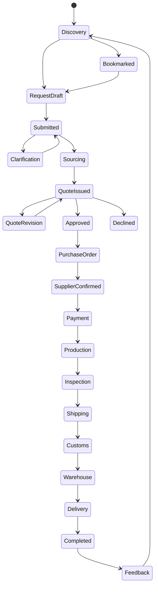
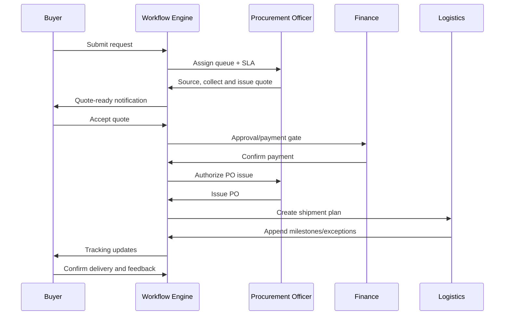

# HAMD Procurement Workflow Engine

**Phase:** 28  
**Status:** Architecture specification - no implementation authorized by this
document  
**Purpose:** Define the governed business workflow that connects procurement,
finance, logistics, communications, and reporting before client, operations, or
public interfaces are built.

## Operating principles

- Domain records, not chat messages or email clicks, are the authoritative
  source of workflow state.
- Every transition validates tenant, actor permission, relationship, current
  state, required data, separation of duties, and reason where applicable.
- A successful transition atomically writes the record, an audit event, an
  activity event, and an outbox event for notifications.
- Issued quotes, POs, invoices, payments, and milestones are immutable.
  Corrections are superseding versions or append-only events.
- AI may draft, explain, classify, flag, and recommend. It may not autonomously
  approve, commit commercial terms, release payment, or alter physical facts.

## End-to-end workflow





## Stage contract

| Stage | Purpose, data, and validation | Owner / permissions | Status and automation | Notifications, KPIs, failure and recovery |
| --- | --- | --- | --- | --- |
| Visitor | Discover reliable supply options. Requires searchable catalog, country, MOQ, lead-time, and certification context. | Visitor; read-only public catalog permission. | `discovery`; SEO index and synonym search may assist. | Track search-to-request conversion. Empty results offer assisted procurement, never a false availability claim. |
| Registered user | Establish an accountable buyer. Requires verified email, organization membership, locale, and contact route. | User / organization admin. | `pending_verification → active`; verification expiry is automated. | Verification reminder; activation rate. Expired token is reissued, not reused. |
| Product discovery/bookmark | Preserve procurement intent and reduce repeat search. Requires product/variant snapshot and list ownership. | Buyer; own organization only. | Bookmark/list changes are non-commercial. Recommendations may rank verified catalog items. | Save/share notification only when requested. Track save-to-request conversion. Deleted products retain a snapshot. |
| Request draft/submission | Create a structured sourcing mandate. Requires one item, quantity/unit, destination, requester, budget/currency where known, required-by date, and restricted-goods declaration. | Requester creates own draft; officer may assist. | `draft → submitted`; missing-data detector creates a checklist only. | Queue assignment and acknowledgement SLA. Failure: invalid/missing data; recovery: preserve draft and focus field errors. |
| Internal review | Triage risk, priority, category, feasibility, and owner. Requires assignment, SLA class, and clarification checklist. | Officer; lead for high-risk requests. | `submitted → needs_clarification | sourcing`; no sourcing while critical fields are missing. | Buyer receives factual next step; KPI: request-to-first-response. Recovery: reassign queue with audit reason. |
| Supplier matching/RFQ | Produce evidence-backed candidates and bids. Requires supplier eligibility, risk tier, capability, corridor, and request scope. | Officer; procurement lead approves high-risk/new supplier. | `sourcing`; future RFQ is a first-class object. AI suggests verified candidates only. | Supplier-response and sourcing-cycle KPIs. Failure: no viable supplier; recovery: buyer alternatives, revised spec, or cancel. |
| Quote collection/comparison | Normalize commercial options. Requires currency, validity, supplier, line quantities, cost components, lead time, exclusions, and evidence. | Officer drafts; lead reviews; buyer reads. | `draft → internally_reviewed → issued`; comparison is a read model, not an approval. | Quote-ready notice; KPI: quote cycle time and landed-cost variance. Recovery: new superseding version, never overwrite issued quote. |
| Customer approval | Obtain an explicit, policy-compliant buyer decision. Requires non-expired version and approved policy route. | Requester accepts within authority; org approver handles thresholds. | `issued → accepted | declined | revision_requested`; automation expires quote only after valid window. | Approval reminders and expiry notices. Failure: stale row version or policy conflict; recovery: refresh/reissue. |
| Purchase order | Form supplier commitment. Requires accepted quote, supplier eligibility, approved terms, and approval completion. | Officer creates; authorized issuer releases. | `draft → issued → acknowledged → fulfilled`; future change order is separate. | Supplier and buyer confirmation; KPI: PO acknowledgement time. Recovery: approved change order or cancellation with reason. |
| Payment | Record financial intent separately from proof. Requires invoice/payment request, amount, currency, approver, method, and provider evidence. | Finance creator and controller must be separate for policy-gated payments. | `draft → requested → initiated → pending_confirmation → confirmed → allocated → settled`. | Payment receipt/exception alerts; KPI: confirmation lag, unreconciled value. Failure: mismatch/failed transfer; recovery: controller reconciliation, never auto-confirm. |
| Production/inspection | Control fulfillment readiness. Requires supplier confirmation, production plan, inspection plan, and evidence. | Supplier partner future; officer/quality operator now. | Future explicit production and inspection states; inspection result is append-only. | Delay/risk alerts; KPI: inspection pass rate. Recovery: remediation or approved substitution. |
| Shipping/customs | Maintain accurate physical custody and compliance facts. Requires shipment plan, corridor, documents, carrier/forwarder source, and ETA. | Logistics updates; buyer reads. | Milestones are append-only and confidence-scored; `exception_open` is parallel to physical state. | Milestone and delay alerts; KPI: ETA accuracy, exception response. Recovery: superseding milestone with evidence. |
| Warehouse/delivery | Verify receipt and close physical fulfillment. Requires receiving, quality result, dispatch, POD, and delivery contact. | Warehouse/logistics; buyer confirms issue-free delivery. | `warehouse_received → dispatched → delivered → completed`. | POD and delivery notices; KPI: OTIF. Failure: damage/missing item; recovery: linked exception/dispute, not a silent completion. |
| Completion/feedback/repeat | Close commercial lifecycle and improve future procurement. Requires final delivery, dispute window outcome, documents, and closure owner. | Buyer feedback; operations closes. | `fulfilled → closed`; templates and history support repeat requests. | CSAT/reorder prompt; KPI: repeat procurement rate. Recovery: reopen only through authorized dispute workflow. |

## Canonical state rules

### Procurement request

```text
draft → submitted → needs_clarification ⇄ accepted_for_sourcing → sourcing
→ quote_issued → revision_requested ⇄ quote_issued
→ approved | declined | expired
→ purchase_in_progress → fulfilled | cancelled | closed
```

### Quotation, approval, payment, and shipment

```text
Quotation: draft → internally_reviewed → issued → accepted | declined | expired | superseded
Approval: pending → approved | rejected | delegated | expired
Payment: draft → requested → initiated → pending_confirmation → confirmed → allocated → settled
Shipment: planned → supplier_ready → pickup_scheduled → picked_up → export_cleared
→ departed → transshipment → arrived → import_cleared → warehouse_received
→ quality_checked → dispatched → out_for_delivery → delivered → completed
```

## Approval and transition rules

1. A requester cannot approve their own threshold-gated commercial decision.
2. A payment creator cannot be its final controller approver.
3. Quote acceptance requires an unexpired quote, current row version, and
   completed approval policy.
4. PO issue requires an accepted quote, eligible supplier, and validated terms.
5. Payment confirmation requires provider or bank evidence; upload alone is not
   confirmation.
6. A milestone requires source, timestamp, confidence, and actor/evidence.
7. Destructive or terminal actions require a reason and are audited.
8. Transition commands are idempotent and use a correlation/idempotency key.

## Automation and AI policy

Allowed in Phase 1: intake completeness checks, classification, SLA alerts,
supplier suggestions from verified candidates, document summaries, quote
explanations, translation, risk flags, and draft communications.

Forbidden in Phase 1: autonomous supplier award, PO issue, approval, payment
release, customer commitment, or physical-milestone assertion.

## Exceptions and recovery

| Exception | Required response | Recovery |
| --- | --- | --- |
| Missing specification | Clarification checklist, owner, due time | Return to buyer without losing draft data |
| Quote expiry/variance | Reason, commercial delta, new version | Supersede and reissue |
| Supplier/compliance risk | Risk tier, evidence, lead review | Substitute supplier or cancel |
| Payment discrepancy | Amount, provider evidence, finance owner | Reconciliation or dispute |
| Customs/delay/damage | Severity, impact, owner, next update time | Append exception and superseding milestone |
| Delivery dispute | POD, photos, affected lines, decision authority | Credit/replacement/claim workflow |

## Reporting and KPIs

Core workflow measures are request-to-first-response, quote cycle time, quote
acceptance rate, approval aging, payment confirmation lag, landed-cost
variance, supplier OTIF, inspection pass rate, ETA accuracy, exception response
time, buyer satisfaction, and repeat procurement rate.

Every KPI must define owner, formula, currency treatment, date window, and
source events. Notifications and chat acknowledgements never count as formal
approval or payment evidence.

## Future extensions

- RFQ supplier portal and bid normalization
- policy-based multi-stage approvals and delegated authority
- contracts/change orders and budget controls
- warehouse, inventory, container, and carrier integrations
- ERP/accounting sync, EDI, SSO/SCIM
- OCR document extraction, ETA prediction, and low-risk agentic work with a
  separate human approval gate

## Implementation alignment required

Before the workflow engine is implemented, the schema must add or formally
defer: approval policies/decisions, RFQs/bids, request status events and
assignments, quote versions/cost components, PO acknowledgements/change orders,
shipment exceptions, and the full shipment lifecycle. This specification is the
canonical source for resolving those state-model gaps.
