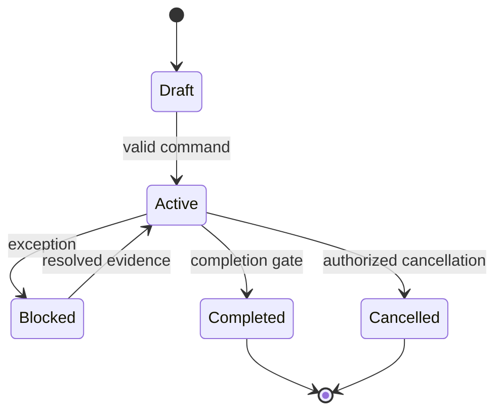
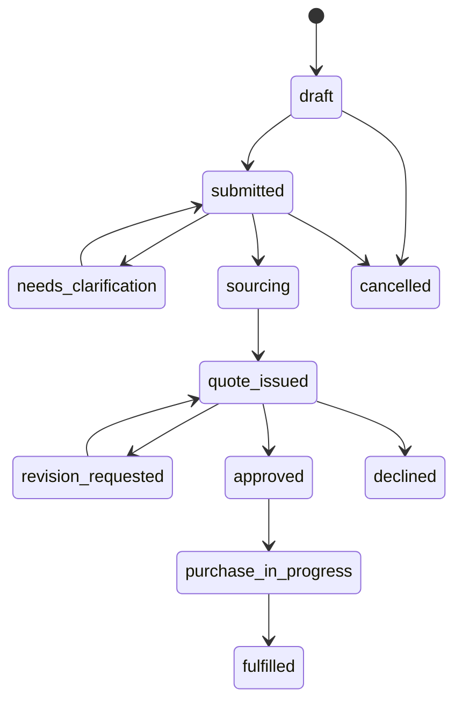
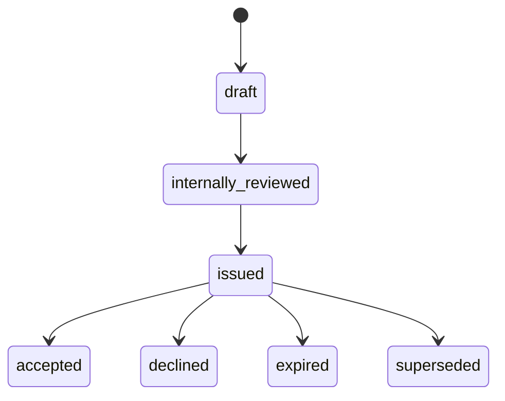
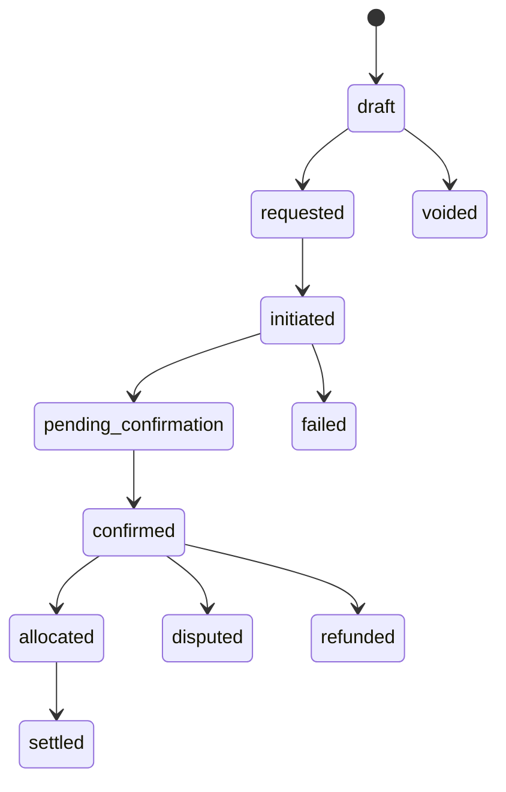

# HAMD Enterprise State Management

**Phase:** 29  
**Status:** Documentation only  
**Rule:** A status can change only through a named domain command. Direct status
updates from controllers, jobs, imports, chat, email, or AI are prohibited.

## Universal state-machine contract

Every transition validates:

1. tenant and record relationship;
2. current state and allowed target state;
3. actor permission and separation of duties;
4. required data, evidence, and reason;
5. optimistic `rowVersion`;
6. transition idempotency key;
7. transactional audit/activity/outbox events.

All terminal states are immutable except through a named reopening, superseding,
credit, dispute, or correction workflow. AI can recommend a transition but
cannot execute it.

## Procurement request

| Transition | Actor / permission | Validation and automatic action |
| --- | --- | --- |
| `draft → submitted` | Requester / `procurement:write` | Item, quantity, destination, contact, restricted-goods declaration. Start SLA and queue notification. |
| `submitted → needs_clarification` | Officer / `procurement:triage` | Reason and checklist required; notify requester. |
| `submitted → sourcing` | Officer / `procurement:source` | Triage complete, no blocking checklist. |
| `sourcing → quote_issued` | Officer / `quotation:issue` | Valid issued quote linked; notify buyer. |
| `quote_issued → approved/declined` | Buyer or approver / `quotation:accept` | Current non-expired quote and policy approval. |
| `approved → purchase_in_progress` | Officer / `purchase_order:create` | Accepted quote and PO link. |
| `→ cancelled` | Requester/lead / `procurement:cancel` | Reason; forbidden after PO except cancellation/dispute flow. |

Forbidden: `draft → fulfilled`, `declined → purchase_in_progress`, and any
transition that bypasses a required quote or approval. Timeout: draft reminders;
quote-expiry job moves the request to `expired` or requests a reissue.

## RFQ

States: `draft → published → collecting → closed → awarded | no_award |
cancelled`.

| Rule | Detail |
| --- | --- |
| Actors | Officer creates/publishes; procurement lead closes/awards. |
| Permission | `rfq:write`, `rfq:publish`, `rfq:award`. |
| Validation | At least one request item, eligible supplier invite, response deadline, terms and currency. |
| Automation | Deadline closes collection; missing-bid reminders; AI normalizes bids but cannot award. |
| Forbidden | Award before close, publish after cancellation, modify published scope without amendment version. |
| Audit/notify | Invite, publish, bid received, close, award/no-award; buyer only sees permitted outcome. |
| Recovery | Amendment creates new RFQ version; cancelled RFQ cannot reopen. |

## Quotation

| Transition | Actor / permission | Rules |
| --- | --- | --- |
| Draft/review/issue | Officer/lead / `quotation:write`, `quotation:issue` | Cost lines, supplier/option, currency, validity, terms, and item quantities required. |
| Accept/decline | Buyer/approver / `quotation:accept` | Version must be current and non-expired; policy route complete. |
| Supersede | Officer / `quotation:revise` | New version references old; issued version remains immutable. |
| Expire | System | Validity timestamp reached; send reminder before expiry. |

Forbidden: edit issued amount/terms, accept an expired/superseded quote, or
accept without required policy approval. AI may explain delta, risk, and
comparison only.

## Purchase order

States: `draft → issued → acknowledged → partially_fulfilled → fulfilled →
closed`; terminal alternatives: `cancelled`.

| Rule | Detail |
| --- | --- |
| Actors | Officer drafts; authorized issuer releases; supplier acknowledgement is recorded by officer/integration. |
| Permission | `purchase_order:write`, `purchase_order:issue`, `purchase_order:cancel`. |
| Validation | Accepted quote, supplier eligibility, currency/terms, line snapshots, policy completion. |
| Automatic | Supplier acknowledgement reminder and overdue escalation. |
| Forbidden | Issue without accepted quote; alter issued lines; fulfil cancelled PO. |
| Recovery | Approved change order produces a version/amendment, never an in-place issued PO edit. |

## Invoice

States: `draft → issued → partially_paid → paid`; alternative states:
`overdue`, `voided`.

Required permissions: `invoice:write`, `invoice:issue`, `invoice:void`.
Issue requires organization, unique invoice number, currency, amount, due date,
and immutable line snapshot. The overdue job evaluates due date only; it does
not charge or notify a payment provider. Void requires reason and finance
authority; paid invoices are corrected by credit/debit flow, not voided.

## Payment

| Transition | Actor / permission | Validation and recovery |
| --- | --- | --- |
| Request/initiate | Finance / `payment:create`, `payment:initiate` | Invoice, amount, currency, method, idempotency key. |
| Confirm | Finance controller / `payment:confirm` | Provider/bank evidence; creator cannot confirm own policy-gated payment. |
| Allocate | Finance / `payment:allocate` | Allocation positive, currency-compatible, no over-allocation under transaction lock. |
| Fail/refund/dispute | Finance controller / dedicated permission | Provider evidence, reason, linked allocation adjustment. |

Notifications: requester receipt, finance exception, controller approval.
Timeouts: pending confirmation escalates; never auto-confirms. AI flags anomalies,
duplicates, and reconciliation risk only.

## Shipment

States: `planned → supplier_ready → pickup_scheduled → picked_up →
export_cleared → departed → transshipment → arrived → import_cleared →
warehouse_received → quality_checked → dispatched → out_for_delivery →
delivered → completed`; alternatives: `held`, `cancelled`, `returned`, `lost`.

| Rule | Detail |
| --- | --- |
| Actors | Logistics operator or trusted carrier integration; buyer is read-only. |
| Permission | `shipment:write`, `shipment:milestone:create`, `shipment:exception:manage`. |
| Validation | Source, occurred/estimated time, confidence, location, evidence where required. |
| Audit | Append-only milestone; corrections create superseding milestone. |
| Notifications | Major milestone, ETA change, delay, customs/quality exception, POD. |
| Forbidden | Rewriting physical facts, delivered before pickup, completing without POD/delivery evidence. |
| Recovery | Parallel exception record with severity, owner, impact, next update, resolution target. |

AI may predict ETA and explain delay evidence; it cannot claim a carrier event as
confirmed.

## Support ticket

States: `open → pending → customer_waiting → resolved → closed`; `resolved →
open` only when reopened within retention policy.

Support agent requires `support:write`; closing requires resolution code and
customer-visible summary. SLA timers pause only in `customer_waiting` with
audited reason. Automation routes by category/priority; AI drafts summaries and
suggested articles, never sends a final response without an agent.

## Celebration

States: `draft → in_review → scheduled → active → expired → archived`;
alternatives: `rejected`, `cancelled`.

Content editor creates, approver publishes, platform admin can emergency-disable.
Activation requires audience, valid start/end date, accessibility/motion policy,
asset scan result, and approved CTA. The scheduler activates/expires records.
An active record is versioned; edits create a future revision. AI may draft
copy but cannot publish.

## User invitation

States: `draft → sent → accepted | expired | revoked`.

Organization admin requires `membership:invite`; validate organization, email,
role scope, expiry, and seat/policy rule. Invite tokens are hashed and
single-use. The system expires and reminders invitations. Resend creates a new
token/version; revoked/accepted invitations never reactivate.

## API and database considerations

- Use `POST /{resource}/{id}/transitions` with `{ command, reason,
  idempotencyKey, rowVersion }`; never expose generic status PATCH.
- Return transition error codes: `INVALID_TRANSITION`, `STALE_VERSION`,
  `APPROVAL_REQUIRED`, `MISSING_PREREQUISITE`, `SEPARATION_OF_DUTIES`, and
  `TERMINAL_STATE`.
- Persist state events separately from mutable records. Audit events are
  immutable; notifications originate from outbox events after commit.
- Add explicit state-event, approval, RFQ, change-order, and shipment-exception
  tables before implementing these machines. Existing status columns alone are
  insufficient.

## Testing strategy

- Table-driven unit tests for every allowed and forbidden transition.
- Permission, tenant, relationship, SoD, stale-version, idempotency, and
  timeout tests.
- Integration tests assert record + audit + outbox are committed atomically.
- Property tests prevent terminal-state escape and invalid lifecycle shortcuts.
- E2E tests cover buyer/officer/finance/logistics handoffs and notification
  delivery without treating notification interaction as approval.
