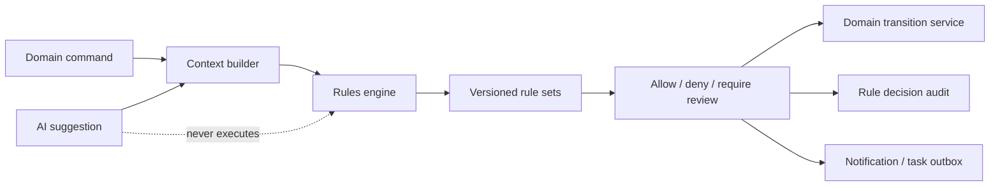

# HAMD Enterprise Rules Engine

**Phase:** 30  
**Status:** Documentation only  
**Mission:** Centralize deterministic business policy so controllers orchestrate
requests but never contain commercial, compliance, approval, or operational
decision logic.

## Architecture



The engine evaluates an immutable context and returns a decision:

```text
allow | deny | require_review | require_approval | warn
```

Every response includes matched rules, priority, evidence, policy version,
explanation code, and recommended next action. Controllers may not override a
deny; an authorized policy exception is a separate audited command.

## Rule model

| Field | Purpose |
| --- | --- |
| Rule key/version | Stable identity and reproducibility |
| Scope | Platform, organization, corridor, category, supplier, or workflow |
| Trigger | Domain command/event that invokes evaluation |
| Conditions | Typed, allowlisted predicates over context |
| Action | Allow, deny, warn, create task, require approval/review |
| Priority | Higher number evaluates first; terminal deny wins |
| Effective window | Start/end date and status |
| Dependencies | Required data source and upstream rule/result |
| Exception policy | Who can override, evidence, expiry, and SoD |
| Audit payload | Redacted inputs, rule version, decision, actor/correlation |

Rules are declarative data with typed condition operators; arbitrary executable
scripts, user-supplied SQL, and unrestricted expressions are prohibited.

## Rule catalogue

| Rule | Purpose / trigger | Conditions / action / priority | Dependencies, exceptions, audit, AI |
| --- | --- | --- | --- |
| Minimum order quantity | Prevent unfulfillable request/quote/PO quantities. Trigger: submit, quote issue, PO issue. | Product/supplier MOQ, unit conversion, quantity. Deny below MOQ; warn near threshold. Priority high. | Catalog and supplier capability. Officer exception with supplier evidence. Log quantity, unit, source. AI suggests consolidating demand. |
| Supplier availability | Avoid quoting unavailable suppliers. Trigger: sourcing, RFQ invite, PO issue. | Supplier status, capacity, holiday/corridor block, product capability. Deny suspended; require review for stale data. | Supplier profile, capability, compliance. Lead override only. AI ranks verified alternatives. |
| Country restrictions | Block prohibited source/destination combinations. Trigger: request submit, supplier match, shipment plan. | Origin, destination, product category, sanctions/restriction lists. Terminal deny for prohibition. | Country/compliance data. Compliance exception only where legally permitted. Audit regulation source/version. AI explains but does not interpret law. |
| Import regulations | Ensure required permits/documents are known. Trigger: sourcing, PO issue, customs milestone. | Product classification, corridor, Incoterms, value, end use. Require review/documents; deny only confirmed restriction. | Regulation provider, documents. Compliance officer may resolve with evidence. AI drafts checklist with citations. |
| Quotation expiration | Prevent acceptance of stale commercial terms. Trigger: quote accept, PO create. | Current time versus validity, quote version, approval status. Deny expired; create reissue task. | Quote record and approval state. No override; new version required. Log server timestamp. AI warns before expiry. |
| Invoice due date | Enforce contractual payment schedule. Trigger: invoice issue, payment request. | Issue date, terms, due date, currency, PO/contract terms. Require correction if mismatch. | PO/contract. Finance override with reason. Audit calculated/result dates. AI predicts overdue risk. |
| Payment verification | Prevent false payment confirmation. Trigger: confirm/allocate payment. | Provider event signature, bank evidence, amount/currency/reference match, reconciliation state. Deny mismatches; require review unknowns. | Payment provider/bank feed. Controller exception cannot mark settled without evidence. AI detects anomalies only. |
| Approval limits | Apply delegated authority and SoD. Trigger: quote accept, PO issue, payment release, change order. | Amount, currency-normalized threshold, category, risk tier, actor authority, creator/approver identity. Require approval or deny. | Membership roles, FX, supplier risk. Time-limited delegation only. Audit full policy path. AI explains routing. |
| User permissions | Enforce RBAC plus tenant/relationship/state access. Trigger: every protected command/query. | Membership status, permission, record organization, assignee/requester relationship, state. Deny unauthorized. | Identity/RBAC. No AI or user override. Audit denied attempts selectively/rate-limited. |
| Inventory rules | Protect stock integrity. Trigger: reserve, allocate, dispatch. | Available-to-promise, reservation, expiry, safety stock, SKU status. Deny negative allocation. | Future inventory ledger. Warehouse manager exception creates adjustment event. AI predicts replenishment only. |
| Warehouse capacity | Prevent unsafe/over-capacity receiving. Trigger: inbound plan, warehouse arrival. | Volume/weight/hazard class, booked slots, capacity, handling constraints. Require reschedule or alternative warehouse. | Future WMS. Logistics lead override with evidence. AI suggests slots. |
| Shipping constraints | Choose valid methods/corridors. Trigger: quote, shipment plan, booking. | Weight/dimensions, dangerous goods, Incoterms, destination, temperature, service level. Deny invalid mode; require review for uncertain classification. | Product, carrier, corridor data. Log source constraints. AI ranks compliant options. |
| Document validation | Prevent unsafe/unusable documents. Trigger: upload, issue, customs/payment gate. | File type/size/hash, malware scan, required document type, signature/expiry, link to record. Quarantine infected; block missing mandatory evidence. | Media scanner, document metadata. Compliance exception only for non-security validation. AI extracts data after clean scan. |

## Evaluation rules

1. Evaluate platform safety/compliance rules before organization preferences.
2. Terminal `deny` dominates lower-priority `allow`.
3. `require_review` blocks irreversible transitions but may allow a draft.
4. Rules never mutate records directly; actions create domain tasks/events.
5. Timeouts execute named system commands using the same engine and audit path.
6. Rule changes are versioned, reviewed, scheduled, and tested against fixtures
   before activation.

## Exceptions

An exception contains rule key/version, record, reason, evidence, authorizer,
expiry, and scope. It never deletes the original decision. Exceptions cannot
override: sanctions/prohibitions, malware quarantine, authorization boundaries,
or missing payment evidence.

## API and database considerations

- Evaluate through an internal `RulesService`; external APIs receive only
  decision summaries and actionable explanation codes.
- Store `rule_decisions`, `rule_exceptions`, `rule_sets`, and
  `rule_set_versions` as append-oriented records.
- Cache static rule sets by version; never cache record-specific compliance or
  payment decisions beyond their evidence freshness.
- Include `policyVersion` and `correlationId` in state-transition audit events.
- Emit metrics: deny/review rate, false-positive review rate, override rate,
  rule latency, stale-data rate, and policy coverage.

## Future AI role

AI may recommend candidate rules from observed exceptions, simulate policy
impact against anonymized history, explain a deterministic decision, and
identify conflicting rules. It cannot publish, modify, disable, or override a
rule. All AI recommendations require human policy-owner approval and regression
tests before activation.
