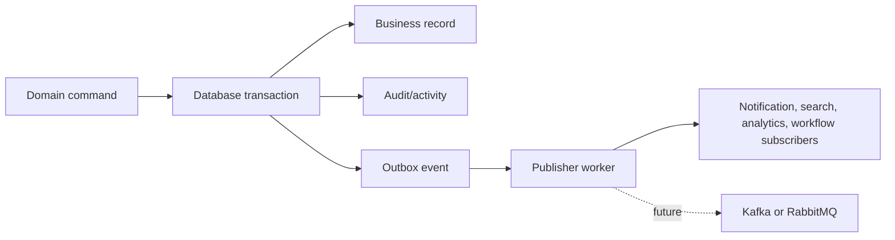

# HAMD Domain Events Architecture

**Phase:** 31  
**Status:** Documentation only  
**Mission:** Make HAMD event-driven without sacrificing transactional truth.

## Event architecture

Domain commands update the business record, audit trail, activity stream, and
outbox event in one database transaction. A worker publishes pending outbox
events to internal subscribers today and a broker adapter later.



Events describe facts in past tense. They never instruct a subscriber to mutate
the originating aggregate. Consumers are idempotent and may receive an event
more than once.

## Envelope

```json
{
  "id": "UUIDv7",
  "name": "procurement.requested",
  "version": 1,
  "occurredAt": "ISO-8601 UTC",
  "aggregate": { "type": "procurement_request", "id": "UUIDv7" },
  "organizationId": "UUIDv7",
  "actor": { "type": "user", "id": "UUIDv7" },
  "correlationId": "UUIDv7",
  "causationId": "UUIDv7",
  "payload": {},
  "metadata": { "schemaVersion": 1 }
}
```

Payloads contain identifiers and safe immutable snapshots, never access tokens,
passwords, payment credentials, raw PII beyond a documented subscriber need, or
unbounded document content.

## Event catalogue

| Event | Publisher | Subscribers | Payload | Retry / idempotency / monitoring |
| --- | --- | --- | --- | --- |
| `identity.user_registered` | Identity service after user + credential transaction | Verification email, audit/activity, analytics | user ID, organization context, locale, registration method | Exponential retry; dedupe on event ID + subscriber name. Monitor verification-delivery failure and registration funnel. |
| `identity.email_verified` | Verification command | Session policy, welcome notification, analytics, audit | user ID, verified timestamp, identity provider | At-least-once; projection upsert by user/version. Alert if verification token replay detected. |
| `catalog.product_added` | Catalog command | Search index, admin activity, recommendation refresh | product ID, category/brand IDs, publication status | Retry indexing; idempotent index document ID = product ID. Monitor index lag. |
| `catalog.product_updated` | Catalog command | Search index, cache invalidation, recommendation refresh | product ID, changed field names, row version | Coalesce same aggregate/version; subscriber ignores older version. Monitor stale-index age. |
| `procurement.requested` | Request submission transition | Assignment queue, SLA timer, buyer/officer notification, analytics | request ID/code, requester, category, priority, required-by date | Retry notifications independently; assignment upsert keyed by request ID. Monitor first-response SLA. |
| `sourcing.rfq_created` | RFQ publish transition | Supplier invitations, sourcing queue, analytics | RFQ ID, request ID, supplier IDs, deadline, currency | Per-recipient delivery records; retry transient provider failure. Monitor invite delivery and bid rate. |
| `commercial.quotation_approved` | Formal buyer/policy acceptance transition | PO eligibility, finance gate, activity, buyer/ops notice | quotation ID/version, request ID, approval IDs, amount/currency | Idempotent PO-eligibility projection. Alert duplicate acceptance or expired quote attempt. |
| `finance.payment_received` | Confirmed provider/bank reconciliation command | Allocation queue, fulfillment gate, receipt notification, finance analytics | payment ID, provider reference, amount/currency, evidence ID | Provider reference + event ID dedupe. Retry reconciliation only; never retry charge. Monitor unmatched payments. |
| `logistics.shipment_created` | Shipment plan command | Tracking projection, logistics queue, buyer notification | shipment ID/code, PO ID, ETA, mode, public token expiry | Idempotent tracking creation. Monitor missing initial milestone. |
| `logistics.shipment_updated` | Milestone/exception append command | Tracking projection, ETA alerting, analytics, buyer notice | shipment ID, milestone ID, type, confidence, occurred/estimated time | Dedupe source event/milestone ID; superseding events are additive. Monitor source freshness and exception SLA. |
| `support.ticket_opened` | Support ticket command | Routing queue, acknowledgement, analytics | ticket ID, requester, category, priority, linked aggregate | Queue upsert by ticket ID; retry acknowledgement. Monitor first-response and reopen rates. |
| `experience.celebration_published` | Approved publishing workflow | Audience delivery projection, website cache invalidation, analytics | celebration ID/version, audience rule IDs, schedule, motion policy | Delivery dedupe by celebration/version/user. Monitor display errors and reduced-motion compliance. |

## Publishing and subscriber rules

1. Publishers own event schema and bump version only for additive compatible
   changes. Breaking changes use a new event version/name.
2. Subscribers may fail independently; an event is marked delivered only after
   each required subscriber records a result.
3. Retry uses exponential backoff with jitter and a bounded attempt count.
   Exhaustion moves to a dead-letter queue with owner, error, and replay tools.
4. Idempotency key is `event.id + subscriber.name`; aggregate version protects
   projections from out-of-order updates.
5. Events are immutable. Correction is a new fact, such as a superseding
   shipment milestone.
6. Notification, email, chat, search, and analytics consumers cannot create
   commercial approval or payment-confirmation transitions.

## Logging and monitoring

Structured logs include event ID/name/version, aggregate, organization, attempt,
subscriber, correlation ID, latency, and sanitized error code. Dashboards track
outbox backlog, publish latency, consumer lag, retry count, dead letters,
delivery success, schema-version mix, and event-to-projection freshness.

Alerts trigger on high-priority event dead letters, sustained backlog, payment
or shipment consumer lag, schema validation failures, and duplicate-event
anomalies.

## Future event bus readiness

### Kafka

Use topic names matching event domains, partition by aggregate ID or
organization ID where ordering matters, retain replayable facts, and publish
schema-registry-compatible envelopes. Kafka is appropriate when analytics,
high-volume tracking feeds, and independent services require replay.

### RabbitMQ

Use a topic exchange keyed by event name, durable queues per subscriber,
dead-letter exchanges, publisher confirms, and per-queue retry delay. RabbitMQ
is appropriate for operational work distribution and lower-volume command
adjacency.

The outbox publisher is the only component that changes when introducing either
broker. Domain publishers and subscribers continue to use the same envelope,
idempotency rules, schema contracts, and audit correlation.
