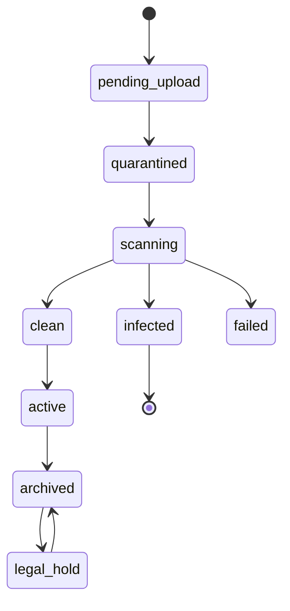

# HAMD Media & Document Platform

**Phase:** 32  
**Status:** Documentation only  
**Mission:** Provide secure, searchable, versioned evidence and media for every
procurement workflow without treating cloud storage as the system of record.

## Scope

Supported classes: images, PDFs, spreadsheets, Word documents, CAD files,
certificates, invoices, purchase orders, shipping/customs documents, inspection
reports, videos, and audio where future collaboration requires it.

## Storage and folder strategy

Object storage is private by default. The database owns metadata, authorization,
version history, retention, links, and audit; the storage provider owns bytes.

```text
{environment}/
  organizations/{organizationId}/
    documents/{documentId}/versions/{versionNumber}/{contentHash}/{originalName}
    media/{mediaId}/original/{contentHash}/{originalName}
    media/{mediaId}/derivatives/{preset}/{contentHash}.{extension}
  quarantine/{uploadId}/{contentHash}
```

Never use customer name, email, procurement code, or raw user input as a
security boundary in a storage path. UUIDv7 IDs and content hashes avoid
enumeration and support deduplication.

## Naming and versioning

- Display filename is preserved as metadata after Unicode normalization and
  unsafe-character removal.
- Storage filename is generated; a user filename never controls path or MIME.
- Document version increments only through an explicit new-version command.
- Issued invoices, POs, certificates, inspection reports, and delivery evidence
  are immutable. A correction links a superseding document/version.
- Content hash, size, detected MIME, uploader, scan result, source, and
  timestamp are stored for every version.

## Lifecycle



Uploads use a short-lived signed URL to quarantine. Only a clean result moves
the object to its durable private location and permits preview/download.

## Database model

`MediaAsset` represents uploaded binary media; `Document` represents a governed
business artifact; `DocumentVersion` represents immutable content; and
`DocumentLink` links a document to a procurement request, quote, PO, invoice,
shipment, supplier, ticket, chat room, or CMS content.

Required columns include UUIDv7 ID, organization ID, owner/uploader, content
hash, original/display name, storage key, byte size, declared/detected MIME,
scan status, retention class, status, created/updated/audit fields, and
deleted/archived timestamps where permitted. Index organization + status,
linked aggregate, hash, retention expiry, and full-text searchable metadata.

`DocumentLink` is append-audited and carries relationship purpose such as
`invoice_evidence`, `shipping_manifest`, `inspection_report`, or
`supplier_certificate`. Links do not grant broader access than the linked
business record.

## API

| Endpoint pattern | Purpose |
| --- | --- |
| `POST /api/v1/uploads/intents` | Validate metadata and issue a quarantine upload intent |
| `POST /api/v1/uploads/{id}/complete` | Verify object/hash and enqueue malware scan |
| `GET /api/v1/documents/{id}` | Read authorized metadata/version history |
| `POST /api/v1/documents/{id}/versions` | Create new governed version |
| `POST /api/v1/documents/{id}/links` | Link document to authorized record |
| `GET /api/v1/documents/{id}/download` | Produce short-lived private download URL |
| `GET /api/v1/documents/search` | Search authorized metadata/content projection |
| `POST /api/v1/documents/{id}/archive` | Archive using retention/permission checks |

All requests validate tenant, relationship, allowed file type/size, scan state,
record state, rate limit, and audit correlation. Download URLs are short-lived,
bound to a single asset/version, and never cached publicly for confidential
documents.

## Permissions

Access is evaluated as:

```text
tenant membership + document classification + linked-record permission
+ document state + relationship purpose
```

Examples: buyers may read their quote and invoice documents; officers may add
sourcing evidence; finance may manage payment evidence; logistics may append
shipping documents; only authorized compliance users may access restricted
certificates. Support access is time-bound and audited. Admin does not imply
unrestricted customer document access without an explicit platform support
policy.

## Security and scanning

- Allowlist extensions and detected MIME; reject double extensions and mismatch.
- Enforce per-type size limits and streamed uploads; never buffer large files in
  the API process.
- Malware scan every upload before activation; quarantined/infected assets are
  inaccessible and retained only for investigation policy.
- Strip or isolate risky active content; never inline untrusted HTML/SVG.
- Sanitize document metadata and prevent path traversal/content-disposition
  injection.
- Encrypt storage and transport; rotate provider credentials; redact storage
  keys from public logs.
- Sign every immutable financial/commercial document hash into the audit trail.

## Preview, CDN, compression, and optimization

Images receive responsive WebP/AVIF derivatives, dimension limits, blur/low
quality placeholders, and EXIF privacy stripping unless required as evidence.
Videos are transcoded asynchronously with poster images; original files remain
private. PDFs preview through a sandboxed viewer; Office/CAD previews use a
trusted conversion service and fall back to download. CDN serves only public
marketing media or signed private URLs; financial and personal documents are
never public-cacheable.

## Retention and archive

| Class | Typical policy |
| --- | --- |
| Temporary upload | Delete after failed/abandoned scan window |
| Operational | Archive after workflow close; delete per contracted retention |
| Financial/commercial | Retain according to jurisdiction/accounting policy; immutable |
| Legal hold | Suspend deletion until hold release |
| Public CMS media | Retain while referenced; archive on unpublish |

Retention is policy-driven by organization/corridor/document purpose. Deletion
is a scheduled, audited action with legal-hold checks and provider deletion
verification.

## Search, OCR, and AI

Current search indexes authorized filename, type, document purpose, record code,
tags, supplier, date, and version metadata. Future OCR runs only after clean
scan, stores extracted text separately with provenance/confidence, and supports
human correction. AI summaries cite document/version/page or section, respect
document permissions, never train on customer data by default, and cannot alter
the source document.

## Future integrations

- Cloudinary or S3-compatible storage for media
- ClamAV/commercial malware scanner
- PDF/Office/CAD conversion provider
- OCR and classification provider
- e-signature/verification providers
- carrier document feeds, ERP accounting attachments, and supplier portal
- DLP, legal-hold, and enterprise retention systems
