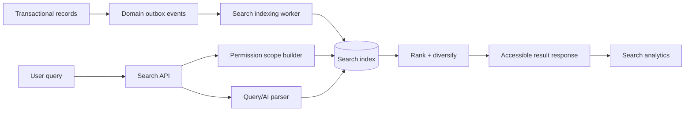

# HAMD Search Platform

**Phase:** 34  
**Status:** Architecture only  
**Mission:** Deliver fast, permission-aware procurement discovery across product,
operational, document, support, content, and knowledge records.

## Search principles

- Search respects tenant, role, relationship, document classification, and
  record-state permission before ranking.
- Structured filters are authoritative; AI interpretation may produce a
  proposed query but never bypasses filters.
- Results reveal type, status, owner, evidence freshness, and next action.
- Indexes are projections, never transactional truth. The source record wins.
- Empty results explain scope and suggest permitted refinements or assisted
  procurement.

## Search domains

| Domain | Primary users | Indexed fields | Sensitive rule |
| --- | --- | --- | --- |
| Products/categories | Visitor, buyer, officer | name, SKU, brand, manufacturer, specs, origin, certifications | Public/organization visibility projection |
| Suppliers/countries | Officer, admin | name, capability, country, risk, category | Risk/bank/compliance details restricted |
| Documents | Authorized record participants | title, type, tags, extracted text, linked code | Scan-clean and link permission required |
| Knowledge/FAQs | Visitor, client, staff | title, body, category, locale | Published/audience scope only |
| Requests/orders/invoices/shipments | Client, ops, finance/logistics | public code, status, owner, dates, amount/ETA where permitted | Organization/relationship scoped |
| Support tickets | Requester, support | subject, status, category, linked record | Requester/agent assignment scope |
| Blog/case studies | Visitor, content team | title, summary, topic, industry, locale | Published content only |

## Architecture



Start with PostgreSQL full-text search, `pg_trgm`, normalized filter columns,
and curated synonyms. Move to OpenSearch/Elasticsearch only when measured
relevance, scale, language analysis, vector retrieval, or operational isolation
requires it. Preserve the same query contract and event-driven indexer.

## Query contract

```text
GET /api/v1/search?q=&scope=&types=&filters=&sort=&cursor=&pageSize=
```

The response returns result type, stable ID, highlight fragments, accessible
label, score explanation category, applied filters, cursor, total approximation,
spell/synonym suggestions, and permitted facets. Cursor pagination is required
for operational results; page size is capped. Search is rate-limited, logged,
and supports cancellation.

## Ranking

Base score is a weighted blend:

```text
text relevance
+ exact code/SKU match boost
+ field priority (name > synonym > description)
+ catalog quality/completeness
+ availability/validity freshness
+ user scope/context affinity
+ recency where domain-appropriate
- deprecated/archived/low-confidence penalty
```

Exact request, invoice, PO, and shipment codes always outrank fuzzy text.
Commercial status never ranks ahead of a user’s authorization scope. Product
popularity is bounded so it cannot hide an exact technical match. Results are
diversified to avoid ten near-identical product variants occupying the first
page.

## Features

### Instant search and autocomplete

Debounce client input, cancel stale requests, and return a small mixed-type
result set: exact codes, product/category/supplier suggestions, recent permitted
records, and query completions. Keyboard arrows, Enter, Escape, focus return,
announced counts, and a clear non-pointer path are mandatory.

### Spell correction and synonyms

Use `pg_trgm`/search-engine suggestions with a confidence threshold. Show
“Search instead for” rather than silently rewriting a query. Synonyms are
curated, versioned, locale-aware policy data: examples include technical
abbreviations, regional trade terminology, and approved brand aliases.

### Facets and filters

Product facets: category, brand, manufacturer, origin, certificate, MOQ,
lead-time band, availability, price/budget band. Operational facets: status,
owner, date range, country/corridor, priority, payment state, shipment
exception. Facets are computed only over the authorized result universe.

### Natural-language and AI suggestions

AI may parse “find 20 verified generators under my Lagos delivery budget” into
visible structured filters and explain assumptions. The user confirms or edits
the query. AI retrieval uses permission-scoped search results and citations; it
does not expose hidden records or make a procurement commitment.

### Saved searches

Saved searches store query, filters, sort, scope, owner/organization, alert
threshold, and retention. Alerts are event-driven, rate-limited, and opt-in.

### Future voice and image search

Voice becomes transcript → visible editable query. Image search uses
privacy-reviewed embeddings, explicit upload consent, malware scan, and product
candidate confidence; it never identifies people or bypasses catalog evidence.

## Indexes and data model

Maintain a `search_documents` projection only if PostgreSQL per-domain material
views become insufficient. It contains document ID/type, organization/visibility
scope, normalized text, language, structured filter JSON, source version,
freshness timestamp, and deletion marker. Use GIN full-text indexes, trigram
indexes for names/codes, B-tree filter indexes, and partial indexes for active
published records. Index updates originate from outbox events and are
idempotent by aggregate version.

Document OCR text is indexed only after malware scan and authorization policy.
Financial amount, supplier risk, and private notes are indexed only in
appropriately scoped internal projections.

## Caching and performance

Cache anonymous public suggestions briefly by normalized query/locale/version.
Cache authenticated results only with organization, permission-scope hash, and
filter key; never share cache entries across tenants. Invalidate by relevant
domain event. Enforce query length, term count, wildcard/fuzzy cost limits,
timeout, circuit breaker, and graceful fallback to exact code lookup.

Targets: autocomplete p95 ≤150ms from cache/≤300ms indexed; standard result
p95 ≤500ms for bounded filters; no unbounded offset scans or synchronous
reindexing in request paths.

## Frontend and admin

The global search command surface supports type filters, recent searches,
keyboard help, loading/skeleton state, error retry, empty-state guidance, and
reduced motion. Domain pages keep scoped filters in the URL for shareability.
Admin search management controls synonyms, boosts, promoted results, index
health, zero-result queries, failed indexing jobs, and search quality review;
it cannot override access policy.

## Analytics and monitoring

Track anonymized/permitted query category, result count, latency, filter use,
click-through, reformulation, zero-result rate, saved-search creation, index
lag, correction acceptance, and downstream outcome such as request creation.
Do not log raw sensitive query content without a documented privacy policy.

Monitor index backlog, event failures, permission-filter mismatches, slow query
rate, zero-result spikes, and relevance-regression experiments. Relevance
changes require offline evaluation sets, human procurement review, rollback
plan, and audit of promoted/boosted outcomes.
