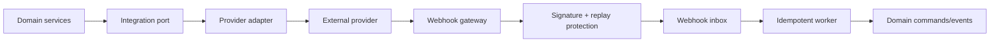

# HAMD Integration Platform

**Phase:** 35  
**Status:** Architecture only  
**Mission:** Make HAMD an open enterprise platform without coupling business
domains to provider SDKs, credentials, webhook formats, or rate limits.

## Architecture



Each integration has a provider-neutral port, provider-specific adapter,
credential record, connection health, sync cursor, webhook inbox, retry queue,
and audit trail. Domain services depend on ports such as `PaymentGateway`,
`CarrierTrackingProvider`, or `CommunicationChannel`, never `StripeSDK` or
`DhlClient`.

## Provider catalogue

| Integration family | Providers | Purpose | Authentication / synchronization / events |
| --- | --- | --- | --- |
| Customer communication | WhatsApp Business, Microsoft Teams, Slack | Transactional updates, approvals, support escalation | OAuth/app tokens; outbound templates and inbound webhook events; delivery/read events normalize to communication delivery records. |
| Productivity | Google Workspace, Microsoft 365 | Calendar, contacts, mail, files, SSO future | OAuth 2.1 with PKCE; incremental sync cursor; consent scopes minimized; token revocation handled. |
| File storage | Google Drive, OneDrive, Dropbox | Import/export governed documents | OAuth; upload/download only through document platform; provider change events become inbox jobs. |
| Media | Cloudinary | Image/video transforms and CDN derivatives | Server-side API key/secret; async transform status webhook; original remains governed by document platform. |
| Payments | Stripe, Paystack, Flutterwave, Wise | Payment initiation, confirmation, refunds, payout/trade finance future | Provider OAuth/API keys/webhook signatures; provider reference is idempotency key; events normalize to payment evidence, never direct status writes. |
| Carriers/logistics | DHL, FedEx, UPS, Maersk | Booking, tracking, shipment documents, ETA | API key/OAuth/partner credential; cursor/poll/webhook feeds normalize to append-only milestones with source/confidence. |
| ERP | SAP, Oracle | Master data, PO/invoice/accounting synchronization | OAuth/SAML/service account depending connector; mapping/versioned sync contracts; outbox-driven export and inbound reconciliation queue. |
| CRM | HubSpot, Salesforce | Lead/customer/account context and activity | OAuth; field allowlist and conflict policy; change data capture/webhooks. |
| Accounting | QuickBooks, Xero | Invoices, payments, reconciliation, tax/export | OAuth; accounting ID mapping; immutable export ledger; reconciliation exceptions require finance review. |
| Analytics/marketing | Meta, Google Analytics | Consent-aware campaign and website attribution | OAuth/service account; aggregated export only; no raw PII without legal/consent policy. |
| AI | OpenAI, Gemini, Anthropic | Approved model access through AI gateway | Provider keys in secret manager; tenant policy, prompt/data redaction, usage limits, evaluation and fallback routing. |

## Integration contract

Every adapter implements:

```text
connect, disconnect, healthCheck, validateConfiguration,
execute(command), handleWebhook(envelope), sync(cursor), mapError
```

Commands and results are typed, provider-neutral, idempotent, traceable, and
carry organization, correlation, causation, timeout, and retry policy. Provider
fields are stored in an adapter metadata namespace, not spread through domain
models.

## Authentication and secret management

- Use OAuth 2.1 Authorization Code with PKCE for user-delegated connections.
- Use short-lived workload identity/service credentials where supported.
- Store refresh tokens/API keys encrypted by envelope encryption with KMS-backed
  key rotation; display secrets once and redact thereafter.
- Scope credentials to organization, provider, capability, environment, and
  expiry. Never share provider connections across tenants.
- API keys issued by HAMD are hashed, prefix-identifiable, scoped, expiring,
  revocable, rate-limited, and audited.

## Webhooks

Webhook endpoints verify signature, timestamp, provider event ID, and replay
window before writing a raw sanitized inbox record. Acknowledge quickly, process
asynchronously, dedupe by provider event ID + provider + connection, and
preserve delivery attempt history. Unknown payload versions quarantine for
review; webhooks never directly mutate financial/commercial state.

## Synchronization and retries

Outbound sync consumes transactional outbox events. Inbound sync uses cursor,
watermark, or provider event ID. Each mapping has a source-of-truth policy,
field ownership, conflict resolution, and deletion/tombstone behavior.

Retries use exponential backoff with jitter, bounded attempts, provider-aware
rate-limit delays, and dead-letter queues. Retrying a payment or booking command
requires an idempotency key; retrying a read/poll is safe but bounded. Manual
replay requires permission, reason, and audit.

## Security, rate limits, and logging

Apply outbound allowlists, TLS verification, request signing where available,
payload-size limits, webhook IP/provider controls where reliable, SSRF
protection, input validation, and least-privilege scopes. Rate limits are
per provider, organization, credential, endpoint, and operation class.

Logs include integration/provider/connection IDs, operation, correlation ID,
latency, response class, retry count, and sanitized provider error code.
Never log authorization headers, raw webhook secrets, full payment payloads, or
document content.

## Monitoring

Monitor connection health, token expiry, webhook verification failures, inbox
lag, sync lag, cursor freshness, retry/dead-letter rate, provider quota, error
rate, mapping conflicts, and per-provider latency. Alert owners before token
expiry and on payment/carrier/ERP sync dead letters. Provide an operations UI
for health, replay, mapping version, and incident links.

## Integration SDK and future expansion

The internal SDK supplies typed ports, command/result envelopes, retry/circuit
breaker helpers, credential resolution, correlation propagation, webhook
verification interfaces, mapping utilities, and test fixtures. It does not
bundle provider SDKs into core domains.

Future capabilities include an external developer portal, OpenAPI/SDK
generation, OAuth app registration, tenant-installed integrations, marketplace
review, SCIM, EDI, iPaaS connectors, sandbox provider accounts, and integration
certification suites.
