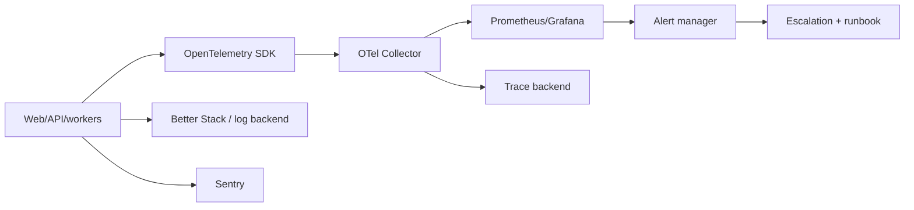

# HAMD Observability Platform

**Phase:** 36  
**Status:** Architecture only  
**Mission:** Make reliability, performance, security, and workflow health
measurable and actionable across every HAMD surface.

## Principles

- Every request, job, event, and integration operation carries a correlation ID.
- Telemetry is structured, sampled deliberately, tenant-safe, redacted, and
  retained by data classification.
- Alerts identify user/business impact, owner, severity, and runbook-not merely
  a noisy threshold.
- Metrics explain trends; traces explain a single path; logs preserve
  diagnostic facts; error tracking groups actionable failures.

## Reference architecture



Use OpenTelemetry as the vendor-neutral instrumentation layer. Grafana and
Prometheus provide metrics/dashboards; Sentry provides error grouping, release
health, and frontend/backend diagnostics; Better Stack provides searchable logs,
uptime checks, and incident collaboration. Exporters may change without
changing application instrumentation.

## Telemetry standards

Required resource attributes: service name/version, deployment environment,
region, release SHA, runtime, and safe instance ID. Required operation
attributes: request/correlation ID, route/command, status class, duration,
organization hash where authorized, actor type, and error code.

Never emit passwords, tokens, API keys, raw authorization headers, payment
details, document content, or sensitive prompts. Use allowlisted dimensions;
high-cardinality identifiers belong in sampled traces/logs, not metric labels.

## Signals

| Signal | Required measures |
| --- | --- |
| Availability | HTTP success/availability, health/readiness, uptime probe, dependency availability |
| API | Request rate, p50/p95/p99 latency, status/error class, route saturation, rate-limit decisions |
| Database | Pool use, connection errors, query duration/count, slow query rate, lock/deadlock, migration result, replication/backup freshness |
| Jobs/events | Queue depth, age, throughput, retry/dead-letter count, outbox lag, subscriber latency |
| Errors/warnings | Grouped exceptions, release regression, unhandled rejections, client errors, warning rate |
| Frontend | Web Vitals, route-load time, bundle error, API failure, rage clicks only with privacy policy |
| Business | Request-to-first-response, quote cycle time, approval aging, payment confirmation lag, OTIF, exception response |
| User | Activation, workflow completion, support response, accessibility error reports, permitted search zero-result rate |
| AI | Request count/cost/latency, model/provider, fallback, token use, citation rate, policy block, escalation, quality evaluation |
| Security | Auth failures, MFA events, denied permissions, suspicious login signals, webhook verification failures, secret-scan findings |

## Dashboards

| Audience | Primary panels |
| --- | --- |
| Executive | Revenue/procurement volume, quote conversion, delivery performance, critical risk, customer growth, SLO health |
| Developers | Golden signals by service, traces, release regressions, error groups, database/query health, queue/outbox lag |
| Operations | Work queues, SLA aging, request/quote/payment/shipment state distribution, exceptions, supplier/route performance |
| Support | Ticket backlog/age, first response/resolution, customer-visible incidents, notification delivery, affected records |
| Security | Authentication anomalies, permission denials, webhook failures, API key activity, security alerts, patch posture |

## SLIs, SLOs, and error budgets

Initial objectives are reviewed after production baselines:

| Service indicator | Initial SLO | Budget / response |
| --- | --- | --- |
| Public/API availability | 99.9% monthly eligible requests | 43.2 minutes/month; freeze nonessential releases on burn |
| Read API latency | 95% under 500ms | Investigate query/cache regression |
| Command API latency | 95% under 1s excluding provider wait | Trace dependency and queue work |
| Event delivery | 99.9% required events delivered within 5 minutes | Page on payment/shipment critical consumer lag |
| Search freshness | 99% indexed updates within 2 minutes | Degrade to source lookup, repair indexer |
| Payment confirmation | 99% provider events processed within 2 minutes | Finance escalation |
| Critical security alert | Acknowledge within 15 minutes | Incident commander engagement |

Error budgets are consumed by user-impacting failure, not planned maintenance
with an approved window. Budget burn changes release policy from normal → review
required → feature freeze.

## Alerting and escalation

Severity is impact-based:

- **P1:** confirmed security compromise, payment integrity risk, broad outage,
  material delivery/commercial harm. Page immediately; incident commander.
- **P2:** major degraded workflow, growing backlog, urgent SLA breach. Alert
  on-call; acknowledge within defined support window.
- **P3:** contained defect or nonurgent degradation. Create owned ticket.

Alerts require: title, impact, signal, threshold/burn window, owner, severity,
dashboard link, runbook, rollback/mitigation, and deduplication key. Use
multi-window burn-rate alerts for SLOs; avoid alerts on transient single
failures.

## Runbooks and incident response

Every P1/P2 alert has a runbook: identify affected tenant/workflow, validate
signal, stop unsafe writes, mitigate/rollback/feature-flag, communicate current
fact/impact/next update, reconcile records, and create post-incident actions.

Incident flow:

```text
detect → triage → declare → assign commander → mitigate → communicate
→ recover → reconcile → post-incident review → action tracking
```

Post-incident reviews are blameless and include timeline, customer impact,
contributing system factors, detection gap, remediation owner, and due date.

## Retention and cost

Set environment-specific sampling and retention. Keep security/audit evidence
per policy; retain high-volume debug traces briefly; sample successful traces,
but retain errors and slow critical workflows. Measure telemetry cost by service
and reject unbounded labels/log payloads.

## Implementation readiness

Instrumentation is introduced with API, worker, integration, and frontend
modules. No dashboard substitutes for health checks, backups, security review,
or operational ownership. Observability configuration itself is versioned,
reviewed, tested, and access-controlled.
