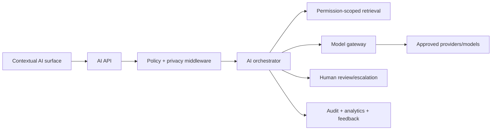

# HAMD AI Governance

**Phase:** 37  
**Status:** Architecture only  
**Mission:** Make HAMD AI an enterprise intelligence layer that assists
procurement work without replacing human authority, permissions, evidence, or
accountability.

## Governing principles

- AI explains, drafts, retrieves, classifies, summarizes, and recommends; it
  does not autonomously approve, commit, pay, publish, contact suppliers, or
  assert unverified physical/commercial facts.
- Every AI response is scoped by tenant, user permission, record relationship,
  data classification, and policy.
- High-consequence output must show source/citation, uncertainty, and a human
  escalation path.
- Prompts, models, retrieval, tools, policy decisions, and feedback are
  versioned and auditable.
- Customer data is not used for provider training by default.

## Architecture



The AI API accepts a purpose-bound request, not unrestricted raw context.
Middleware resolves identity, policy, rate limits, content classification,
redaction, model eligibility, and retention. The orchestrator composes an
approved prompt template, retrieved evidence, tool permissions, and response
format contract.

## Prompt templates

Templates are versioned policy artifacts with:

- stable key, owner, purpose, audience, model constraints, and effective dates;
- system/developer instructions, structured input schema, output schema, and
  allowed tools;
- retrieval requirements, citation format, safety constraints, and fallback;
- evaluation suite, approval history, and deprecation policy.

Template variables are typed and escaped. User content is clearly delimited and
never treated as instructions. Prompt changes require review, regression
evaluation, and rollback-ready versioning.

## Model selection

The model gateway selects from an allowlist using task class, data sensitivity,
language, latency/cost budget, required capability, provider health, and
evaluation score. Providers include OpenAI, Gemini, Anthropic, Azure/enterprise
variants, and future local models behind the same interface.

Fallback is allowed only for compatible task/data policies. A fallback response
records provider/model/version and may be downgraded to draft-only mode.
Provider credentials remain in secret management and are never exposed to
clients.

## Context and retrieval

Retrieval builds an authorization-filtered evidence set from knowledge articles,
published FAQs, clean documents, record timeline, approved catalog data, and
explicitly allowed conversation memory. Each chunk stores source/version,
organization/visibility scope, classification, language, freshness, and
embedding/index version.

The retrieval layer applies permission filters before semantic/vector ranking.
It returns citations and abstains when evidence is weak, stale, conflicting, or
outside scope. AI must say it cannot verify a claim rather than inventing one.

## Knowledge base and conversation storage

Knowledge sources follow publishing/versioning workflows. Ingestion requires
malware-clean documents, classification, extraction provenance, chunking
version, review status, and expiry/reindex rules.

Conversations store organization, participants, purpose, template/model version,
messages, citations, feedback, retention class, and redacted audit metadata.
Memory is opt-in, purpose-limited, editable/deletable under retention policy,
and never crosses organization boundaries.

## Hallucination prevention

1. Prefer structured source data over free-form context.
2. Require citations for procurement, legal, regulatory, financial, supplier,
   shipment, and document claims.
3. Use constrained JSON/schema outputs for automation-adjacent tasks.
4. Validate calculations, currencies, dates, identifiers, and policy claims
   deterministically after generation.
5. Set confidence from evidence quality, not model self-confidence alone.
6. Abstain/escalate when sources conflict or no approved evidence exists.
7. Never let generated text directly execute a state transition.

## Human review and escalation

Human review is required for supplier risk, import/compliance guidance, payment
or invoice interpretation, quote comparison recommendation, contractual
language, sensitive support, and all AI-generated external communications
unless an approved low-risk template permits automation.

Escalation packages the question, visible evidence, draft answer, uncertainty,
policy reason, assigned owner, and SLA. The human decision is captured as
feedback and may update future evaluations, never silently retrain a policy.

## AI SDK, APIs, and middleware

The internal SDK provides typed requests/responses, template resolution,
structured-output validation, provider abstraction, retrieval contracts,
redaction, citations, policy decisions, tracing, budget enforcement, caching,
feedback, and test fixtures.

Key API patterns:

```text
POST /api/v1/ai/conversations
POST /api/v1/ai/responses
POST /api/v1/ai/feedback
POST /api/v1/ai/escalations
GET  /api/v1/ai/conversations/{id}
```

AI middleware enforces authentication, permission scope, prompt-injection
screening, file/document scan state, rate limit, token/cost quota, PII
redaction, tool allowlist, output validation, and audit/outbox creation.

## Caching

Cache only safe deterministic or low-sensitivity outputs keyed by template
version, model policy, normalized input, retrieval source versions, permission
scope hash, locale, and expiry. Do not cache cross-tenant content, sensitive
conversation responses, changing shipment/payment facts, or outputs requiring
human review. Invalidate through source/document/record events.

## Security and privacy

- Minimize context; redact/tokenize PII, secrets, credentials, bank data, and
  restricted documents before provider transmission.
- Enforce regional/data-residency provider policy and data processing terms.
- Encrypt conversation/audit data; separate operational access from model
  administration; retain according to classification.
- Defend against prompt injection, data exfiltration, tool abuse, indirect
  document instructions, and cross-tenant retrieval.
- Rate-limit by user, organization, feature, model, and cost budget.

## Evaluation, testing, and analytics

Maintain versioned evaluation sets by workflow: product discovery, quote
explanation, document summary, translation, support, regulations, and shipment
guidance. Test groundedness/citation correctness, policy compliance, refusal,
permission isolation, structured-output validity, latency, cost, and
regression.

Metrics include request volume, latency, model/provider, token/cost, cache hit,
retrieval freshness, citation rate, abstention, policy block, escalation,
feedback, acceptance/edit rate, and evaluation score. Logs record IDs and
versions, not sensitive raw content by default.

## Future agent architecture

Future agents are purpose-specific, tool-allowlisted workflows with explicit
plan/execute/review states. They operate only on reversible, low-risk tasks
until separately approved. Every tool call uses the same permission, rules
engine, state-machine, idempotency, audit, and human approval controls as a
human-initiated command.
