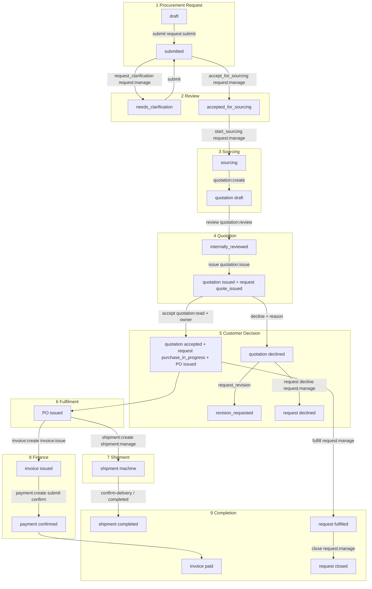

# Phase 2C — Procurement lifecycle audit + V1 → V2 parity

Status: **AUDIT ONLY. No implementation in this document.**

Constraints:

- Do not invent backend mutations, statuses, or permissions that do not already exist.
- Proposed UI must use existing V2 APIs and Prisma relations.
- Where a **read aggregator** is proposed, it is called out explicitly as **PROPOSED (not built)** and only composes existing rows.
- V1 (`admin-dashboard`, `client-frontend`, `backend`) is a functional reference only. V1 stays **READ ONLY**.
- Footer live routes must not change. Dead routes must not return.
- Customer (`apps/web` `/app`) and Admin (`apps/ops`) remain distinct experiences with distinct actions.

---

## 1. Source trees

| Layer | Path | Role |
|---|---|---|
| V1 Admin SPA | `admin-dashboard/` | Ops UI (Vite :5174) |
| V1 Buyer SPA | `client-frontend/` | Customer UI (Vite :5173) |
| V1 API | `backend/` | Express + MySQL |
| V1 index | `legacy/README.md`, `docs/legacy/01-version-1-overview.md` | Archive notes |
| V2 API | `apps/api/` | Genesis `/api/v1` |
| V2 Prisma | `database/prisma/schema.prisma` | Domain + enums |
| V2 Admin UI | `apps/ops/` | Admin/Operations console |
| V2 Customer UI | `apps/web/` `/app/*` | Buyer workspace |
| V2 shared UI | `packages/ui/` | Wizard, quotation workspace, shells |
| Permissions | `apps/api/src/modules/identity/auth/domain/permission-catalog.ts` | Canonical RBAC keys |

There is **no Laravel/PHP admin**. V1 Organisations and Quotations/Invoices/Payments **do not exist** as domains.

---

## 2. V1 Admin behaviour (exact)

### 2.1 Dashboard

- **UI:** `admin-dashboard/src/pages/DashboardPage.tsx` — route `/`
- **APIs:**
  - `GET /api/v1/requests/admin/stats/overview` (`admin-dashboard/src/lib/api.ts` → `getRequestStats`)
  - `GET /api/v1/requests?limit=5` (backend **ignores** `limit`/`page`; returns all)
  - `GET /api/v1/chat/unread/count`
  - `GET /api/v1/ai/stats`
- **KPI cards:** Total Requests, Pending (“Require attention”), Processing, Completed — from `total_requests`, `pending_requests`, `processing_requests`, `completed_requests`
- **Charts:** “Requests This Week” (`weeklyData`), “Request Status Distribution” (Pending / Processing / Approved / Completed)
- **Recent list:** not clickable; empty copy “No recent orders found”
- **Dead CTAs:** New Request (no handler); Quick Actions Process Requests / Manage Users / Client Chat (no navigation)
- **Fabricated:** System Status badges hardcoded; Today’s Summary `todayOrders` never set (always 0); Revenue `$0` hardcoded
- **No attention-queue component.** Closest: Pending KPI + recent list

Backend overview SQL: `backend/routes/requests.js` `GET /admin/stats/overview` counts `pending|processing|approved|completed` + `today_requests` + last 7 days.

### 2.2 Sidebar

- **File:** `admin-dashboard/src/components/layout/Layout.tsx` — `navigation`
- Items: Dashboard `/`, Procurement Requests `/requests`, Users `/users`, Categories `/categories`, Announcements `/announcements`, Client Chat `/chat`, Notifications `/notifications`, Order Tracking `/trackers`, AI Assistant `/ai-assistant`, Settings `/settings`
- Product Catalog `/products` **commented out** of nav (page still routed)
- **No per-item RBAC.** Entire SPA behind admin-only login (`POST /api/v1/auth/admin/login`, `users.role = 'admin'`)
- Header: “Almahbub / Admin Panel”. Sign out → `logout()` + `/login`

### 2.3 Users

- **UI:** `admin-dashboard/src/pages/UsersPage.tsx` — `/users`
- **API:** `backend/routes/users.js` at `/api/v1/users`
- List: `GET /api/v1/users` (UI sends **no** pagination params). Filters are client-side.
- Working mutations: inline role select (`user|moderator|admin`) and status select (`active|inactive|suspended`) → `PUT /api/v1/users/:id`; delete → `DELETE` (cannot delete self; cannot delete if user has orders)
- **Add User / Edit / Filter / Download:** no handlers. **No invite API.**
- UI `status` is **not** a DB column: list maps `email_verified ? active : inactive`. PUT `suspended` still only sets `email_verified=false`
- DB role ENUM: `'user' | 'admin'` (`backend/config/database.js`). API validator also allows `moderator` (would fail MySQL ENUM unless altered outside repo)

### 2.4 Organisations

**Does not exist.** No entity, route, or sidebar item. Closest: `users.company` string.

### 2.5 Procurement request list / detail

Requests persist in MySQL table **`orders`**. Dual routers: `/api/v1/requests` and `/api/v1/orders` (`backend/routes/requests.js`, `orders.js`).

**Admin list** `/requests` — `admin-dashboard/src/pages/RequestsPage.tsx`

- Shows `#${numeric id}`, title, status, name, email, company, time-ago, description
- Working: status `<select>` → `PUT /api/v1/requests/:id { status }`; Eye → `/requests/:id`; Trash → `DELETE`
- Dead: New Request, Edit, Filter, Download
- List status options: `received, reviewing, discussion, sourcing, completed, cancelled`

**Admin detail** `/requests/:id` — `RequestDetailPage.tsx`

- Sections: Client Information; Request Details; Description; Timeline; Files; Admin Actions
- Working: Update Status + Save Notes → `PUT { status, adminNotes }`
- Detail status options (wider): `pending, received, reviewing, discussion, sourcing, processing, approved, rejected, completed, cancelled`
- GET transformer fabricates `paymentMethod: 'Quote-based'`, `paymentStatus: 'pending'`, dummy line item

**Customer (contrast)**

| Surface | Path | File | API |
|---|---|---|---|
| Create | `/create-request` | `client-frontend/src/pages/CreateRequestPage.tsx` | `POST /api/v1/orders` |
| List | `/my-requests` | `MyRequestsPage.tsx` | `GET /api/v1/requests` |
| Detail | `/request/:id` | `RequestDetailPage.tsx` | `GET /api/v1/requests/:id` |

Customer cancel UI only if `status === 'received'`, but calls missing `apiClient.updateOrder`. Dedicated cancel APIs `PUT /requests/:id/cancel` and `/orders/:id/cancel` exist (owner or admin; only from `pending|received`).

### 2.6 V1 status transitions

**Three conflicting vocabularies. No from→to machine.**

| Source | Values |
|---|---|
| MySQL ENUM (`orders.status`) | `pending, processing, approved, rejected, completed, cancelled` default `pending` |
| API allow-list (`PUT /requests/:id`) | `pending, received, reviewing, discussion, sourcing, processing, approved, rejected, completed, cancelled` |
| Customer progress bar | `received, reviewing, in_discussion, sourcing, completed` |

- Admin may set **any** allow-listed status from any current status (`requireAdmin`)
- Cancel endpoint: only `pending|received` → `cancelled`
- On admin status change: email + notification `type: 'order_update'`, `resource_type: 'order'`
- Documented as free-form: `docs/legacy/01-version-1-overview.md`, `docs/legacy/07-version-1-known-issues.md`

### 2.7 V1 quotation workflow

**Does not exist.** No quotation routes, statuses, accept/decline, or UI. Display-only leftovers: `paymentMethod: 'Quote-based'`.

### 2.8 V1 shipment / tracking

**Real table:** `order_tracking` via `backend/routes/tracker.js` — `/api/v1/tracker`

| Method | Path | Who |
|---|---|---|
| POST `/` | admin | `{ orderId, status, description?, location? }` — **status is free-form string** |
| GET `/` | admin | all entries |
| GET `/order/:orderId` | admin or owning customer | |
| PUT/DELETE `/:id` | admin | |

**Admin Order Tracking page** (`TrackersPage.tsx`) **does not call `/tracker`**. It loads requests and **synthesizes** tracking numbers, carriers, ETA, events, and progress percents. Analytics / Export / Phone / Mail: no handlers.

Customer client calls `/requests/tracker/:orderId` which **does not exist** (real path `/tracker/order/:orderId`).

No invoice/payment domain. No document upload on tracker.

### 2.9 V1 notifications

- Table `notifications`: types `order_update|new_message|announcement|system` (+ code also writes `'request'` which is not in ENUM)
- `GET /api/v1/auth/notifications`, `PUT .../:id/read`, `PUT .../read-all`
- Admin bell (`Layout.tsx`): mark all; click → `navigate(\`/${resource_type}/${resource_id}\`)` e.g. `/order/123` (**no such admin route**; requests live at `/requests/:id`)
- Admin notifications page routing is inconsistent (`/requests?id=` vs `/requests/:id`)
- Auth GET returns camelCase (`isRead`, `resourceType`); UI often expects snake_case (`is_read`, `resource_type`)
- Customer Navbar goes to `/notifications` page; `NotificationDropdown.tsx` exists but Navbar does not use it

### 2.10 V1 auth / session

- JWT `expiresIn: '7d'` — `backend/routes/auth.js` `generateToken`
- **No refresh token. No `/auth/refresh`.** Logout is client-side only
- Admin: `admin_token` + Zustand persist; `POST /api/v1/auth/admin/login`
- Client: `client_token`; `POST /api/v1/auth/login`
- Expired JWT → middleware `403 { error: 'Invalid or expired token' }` (not 401)
- Admin `apiClient` on `!response.ok` **throws only** — does not clear token or redirect
- `initialize()`: `GET /auth/me` failure clears token
- Settings `session_timeout: 30` minutes is **local mock** (`SettingsPage.tsx` has zero API calls)
- LoginPage redirect to `/dashboard` is a **dead route** (404)

### 2.11 V1 reference IDs

On create: per-user count → `REQ-0001` stored in `orders.request_number`. Collides across users. Admin list shows `#${numeric id}`. Fallbacks: `REQ-${id padded 6}` or `ORD-${id padded 6}`.

Related records from a V1 request: optional `order_tracking.order_id`, optional `chat_messages.order_id`. **No quotations, invoices, payments, or POs.**

---

## 3. V2 actual capabilities (do not invent)

Base: `/api/v1` (`packages/constants` `API_V1_PATH`). Mount: `apps/api/src/app.ts`.

### 3.1 Prisma enums (source of truth)

`database/prisma/schema.prisma`

| Enum | Values |
|---|---|
| `ProcurementRequestStatus` | `draft`, `submitted`, `needs_clarification`, `accepted_for_sourcing`, `sourcing`, `quote_issued`, `revision_requested`, `approved`, `declined`, `expired`, `purchase_in_progress`, `fulfilled`, `cancelled`, `closed` |
| `ProcurementRequestPriority` | `low`, `normal`, `high`, `urgent` |
| `QuotationStatus` | `draft`, `internally_reviewed`, `issued`, `accepted`, `declined`, `expired`, `superseded` |
| `PurchaseOrderStatus` | `draft`, `issued`, `partially_fulfilled`, `fulfilled`, `cancelled` |
| `InvoiceStatus` | `draft`, `issued`, `paid`, `partially_paid`, `overdue`, `voided` |
| `PaymentStatus` | `draft`, `requested`, `initiated`, `pending_confirmation`, `confirmed`, `allocated`, `settled`, `failed`, `refunded`, `voided`, `disputed` |
| `PaymentMethod` | `manual_bank_transfer` only |
| `ShipmentStatus` | `planned`, `supplier_ready`, `inspection_pending`, `pickup_scheduled`, `picked_up`, `export_cleared`, `departed`, `transshipment`, `arrived`, `import_cleared`, `warehouse_received`, `quality_checked`, `dispatched`, `out_for_delivery`, `delivered`, `completed`, `cancelled`, `held`, `returned`, `lost` |
| `UserStatus` | `pending_verification`, `active`, `suspended`, `deactivated` |
| `OrganizationStatus` | `pending`, `active`, `suspended`, `archived` |
| `SessionStatus` | `active`, `revoked`, `expired` |
| `NotificationType` | `account`, `procurement`, `quotation`, `invoice`, `payment`, `shipment`, `announcement`, `support`, `system`, `security` |
| `NotificationStatus` | `unread`, `read`, `archived`, `deleted`, `expired` |

**Implemented transition maps are smaller than the enums.** Unused enum values must not be exposed as UI actions.

### 3.2 Request state machine (implemented)

File: `apps/api/src/modules/procurement/domain/procurement-request-state.ts`  
Service perm: `apps/api/src/modules/procurement/application/procurement-request-service.ts` `assertTransitionPermission`

| Command | From | To | Who |
|---|---|---|---|
| `submit` | `draft`, `needs_clarification` | `submitted` | requester **or** `request:submit` |
| `request_clarification` | `submitted` | `needs_clarification` | `request:manage` (reason required) |
| `accept_for_sourcing` | `submitted` | `accepted_for_sourcing` | `request:manage` |
| `start_sourcing` | `accepted_for_sourcing` | `sourcing` | `request:manage` |
| `request_revision` | `quote_issued` | `revision_requested` | requester **or** `request:submit` (reason required) |
| `approve` | `quote_issued` | `approved` | `request:manage` |
| `decline` | `quote_issued` | `declined` | `request:manage` (reason required) |
| `start_purchase` | `approved` | `purchase_in_progress` | `request:manage` |
| `fulfill` | `purchase_in_progress` | `fulfilled` | `request:manage` |
| `close` | `fulfilled` | `closed` | `request:manage` |
| `cancel` | `draft`, `submitted`, `needs_clarification`, `accepted_for_sourcing`, `sourcing` | `cancelled` | requester **or** `request:cancel` (reason required) |

**Submit extra rule:** `destinationCountryCode` + `destinationAddress` required (`validateTransitionInput`). Create itself does **not** require destination.

**Side-effect transitions (not request commands):**

- Quotation `issue` → request `sourcing` → `quote_issued` (`quotation-service.ts`)
- Quotation `accept` → request `quote_issued` → `purchase_in_progress` **and creates** `PurchaseOrder` `status: issued`, `publicCode` `PO-…` (`quotation_accepted`)

**No implemented request command for:** `expired`. `quote_issued` is entered via quotation issue, not a request command. **No command from `revision_requested` back into sourcing.**

**Orphan ops path:** `approve` + `start_purchase` does **not** create a PO. Invoice create and shipment create both require a PO in `issued` or (shipments) `partially_fulfilled`. There is **no buyer/ops PO create API** besides auto-create on quotation accept. Therefore **Customer Decision must be quotation accept**, not request `approve`, or fulfilment cannot proceed with existing APIs.

### 3.3 Quotation state machine (implemented)

File: `apps/api/src/modules/procurement/quotation/domain/quotation-state.ts`

| From | Command | To | Permission |
|---|---|---|---|
| `draft` | `review` | `internally_reviewed` | `quotation:review` (ops) |
| `internally_reviewed` | `issue` | `issued` | `quotation:issue` (ops). Request must be `sourcing` |
| `issued` | `accept` | `accepted` | requester **or** `quotation:approve`; HTTP also allows `quotation:read` / `request:read` |
| `issued` | `decline` | `declined` | same as accept; **reason required** |

Create: `POST /api/v1/quotations` requires `procurementRequestId`, `items` min 1; request must be `accepted_for_sourcing` or `sourcing`; perm `quotation:create`.

Revise: `POST /api/v1/quotations/:id/revise` (`quotation:revise`) — not a `quotationCommands` value. No command map for `expired` / `superseded`.

**Buyer must not receive `quotation:review`.** Buyer decide is ownership + read, not review.

Decline quotation does **not** automatically change request status (only quotation row). Ops may then `request_revision` or request `decline`.

### 3.4 Shipment / invoice / payment (implemented subset)

**Shipment** — `apps/api/src/modules/logistics/shipment/domain/shipment-state.ts`  
Create: `shipment:create`, required `purchaseOrderId`, PO must be `issued` or `partially_fulfilled`.  
Transitions: `shipment:manage`. Confirm delivery: `shipment:confirm` (separate endpoint, not a `ShipmentCommand`).  
**No implemented entry into** `inspection_pending`, `transshipment`, `quality_checked`, `returned`, `lost`.  
List filters: `status`, `purchaseOrderId`, `carrierName`. **No `procurementRequestId` filter.**

**Invoice** — `invoice-state.ts`: `draft` → `issue` → `issued`; `draft|issued` → `void` → `voided`. `paid` / `partially_paid` set on payment confirm. **No path to `overdue`.** Create requires `purchaseOrderId`, `invoiceNumber`, `items` min 1; PO must be `issued`. List filter: `purchaseOrderId`. **No `procurementRequestId`.**

**Payment** — `payment-state.ts`: `draft` → `submit` → `pending_confirmation` (creator + `payment:submit`); `pending_confirmation` → `confirm` → `confirmed` (`payment:confirm`, confirmer ≠ creator). **No transitions** for most enum values. Buyers have **read only**.

### 3.5 Request / quotation / finance / logistics routes

| Method | Route | Auth / perm |
|---|---|---|
| GET/POST | `/api/v1/procurement-requests` | authenticate; service `request:read` / `request:create` |
| GET/PATCH | `/api/v1/procurement-requests/:requestId` | `request:read` + requester or `request:manage`; PATCH draft only |
| POST | `/api/v1/procurement-requests/:requestId/transitions` | per-command |
| POST | `.../assignments` | `request:assign` |
| POST | `.../archive` `.../restore` `.../duplicate` | archive/restore/duplicate perms |
| GET/POST | `/api/v1/quotations` | read: `quotation:read` or `request:read`; create: `quotation:create` |
| GET/PATCH | `/api/v1/quotations/:quotationId` | read / `quotation:update` (draft) |
| POST | `/api/v1/quotations/:quotationId/transitions` | review/issue/accept/decline |
| POST | `/api/v1/quotations/:quotationId/revise` | `quotation:revise` |
| GET | `/api/v1/quotations/:quotationId/history` | read |
| GET/POST | `/api/v1/shipments` | read: `shipment:read` or `request:read`; create: `shipment:create` |
| POST | `/api/v1/shipments/:id/transitions` | `shipment:manage` |
| POST | `/api/v1/shipments/:id/confirm-delivery` | `shipment:confirm` |
| GET/POST | `/api/v1/invoices` | `invoice:read` / `invoice:create` |
| POST | `/api/v1/invoices/:id/issue` `/void` | `invoice:issue` / `invoice:void` |
| GET/POST | `/api/v1/payments` | `payment:read` / `payment:create` |
| POST | `/api/v1/payments/:id/submit` `/confirm` | `payment:submit` / `payment:confirm` |

GET request serialize (`procurement-request-controller.ts`) includes id, **publicCode**, status, title, currency, notes, destination, dates, budget, priority, requester, items, attachments. **Does not include quotations / POs / shipments / invoices / payments.**

### 3.6 Public / reference IDs (V2)

| Entity | Public id | Generation | Lookup today |
|---|---|---|---|
| Request | `publicCode` unique per org | `PR-` + 10 hex (`procurement-request-repository.ts`) | GET by **UUID only**. List `q` searches `publicCode` + title |
| Quotation | `publicCode` | `QT-` + 10 hex | UUID; list `?procurementRequestId=` |
| Purchase order | `publicCode` | `PO-` + 10 hex on quote accept | **No buyer PO API**. Ops `GET /api/v1/ops/purchase-orders` (org list; **no `procurementRequestId` query filter**, field is returned) |
| Shipment | `publicCode` | client optional or generated `SH-…` | UUID; list `?purchaseOrderId=` |
| Invoice | `invoiceNumber` (client-supplied) | not auto `PR/QT` style | UUID; list `?purchaseOrderId=` |
| Payment | UUID + `idempotencyKey` | none | UUID |

`publicCode` is the **permanent human reference**. UUID remains the API key.

### 3.7 Notifications (V2)

Routes: `apps/api/src/modules/communication/notification/api/notification-routes.ts`

| Method | Route | Perm |
|---|---|---|
| GET `/api/v1/notifications` | `notification:read` | query `pageSize`, `status`, `type`, `priority`, `q` |
| GET `/api/v1/notifications/unread-count` | → `{ count }` | |
| POST `/api/v1/notifications/read` | `{ notificationIds: uuid[] }` | |
| POST `/api/v1/notifications/read-all` | | |
| archive / unread / delete / preferences | also exist | |

Inbox is recipient + org scoped. Prisma `deepLink` exists but **dispatch does not populate it**; payload lives in `metadata`. Client resolver: `packages/ui/src/notifications/resolve-notification-href.ts` (metadata ids → `/requests|quotations|shipments|invoices|payments/:id`, audience `app` vs `ops`).

### 3.8 Auth / session (V2)

Routes: `apps/api/src/modules/identity/auth/api/auth-routes.ts`  
Authenticate: `apps/api/src/shared/auth/authenticate.ts`

| Method | Route | Notes |
|---|---|---|
| POST `/api/v1/auth/login` | public | email + password; optional `rememberMe` |
| POST `/api/v1/auth/refresh` | public + CSRF cookie `hamd_csrf` + httpOnly `hamd_refresh` | |
| POST `/api/v1/auth/logout` | authenticated | revoke session, clear cookies, 204 |
| GET `/api/v1/auth/me` | authenticated | user + **live permissions** |

- Access JWT HS256 claims `{ sub, org, sid, ver }`. TTL `ACCESS_TOKEN_TTL_SECONDS` default **3600**. Refresh cookie default **7d**.
- Invalid/missing access → **401** `UNAUTHENTICATED`
- Session revoked / `tokenVersion` mismatch → **401** `SESSION_REVOKED`
- Bad refresh → **401** `INVALID_REFRESH_TOKEN` (cookies cleared unless CSRF fail → 403)

**Clients today:**

- `apps/web/src/auth/session/AuthProvider.tsx` and `apps/ops/src/auth/session/AuthProvider.tsx`: in-memory access token; `ensureSession` refreshes if not fresh; failed refresh → status `"expired"`
- `RequireAuth`: `"expired"` → **`/session-expired`**; anonymous → `/login?returnTo=...`
- Module fetchers (`opsFetch`, procurement/quotation/notification APIs) generally **do not retry 401 after refresh**. Ops dashboard **shows inline** “Your session expired. Sign in again…” — user remains on an authenticated screen. This **fails** the 401 acceptance criterion.

### 3.9 Permissions

File: `apps/api/src/modules/identity/auth/domain/permission-catalog.ts`

**`DEFAULT_BUYER_PERMISSIONS`:**  
`request:read|create|update|submit|cancel|archive|duplicate`, `quotation:read`, `invoice:read`, `payment:read`, `shipment:read`, `notification:read`, `guidance:read`, `ai:use`

**Not buyer:** `request:manage|assign|restore`, all quotation write/review/issue/approve/revise, invoice write/issue/void, payment create/submit/confirm, shipment create/update/manage/confirm, `notification:manage`, `communication:*`, `guidance:manage`, `ops:access`, `audit:read`, `cms:manage`

**`DEFAULT_OPS_PERMISSIONS`:** buyer set **plus** all privileged keys above, including `quotation:review`, `quotation:approve`, `ops:access`, `audit:read`, `cms:manage`.

`org_admin` (company owner) ≠ Ops. Ops UI: `apps/ops/src/auth/guards/RequireOpsAccess.tsx` + API `requirePermission("ops:access")` on `/api/v1/ops/*`.

JWT does **not** carry permissions. Server policy is authoritative.

### 3.10 Create request schema (wizard source of truth)

File: `apps/api/src/modules/procurement/api/procurement-request-schemas.ts` `createProcurementRequestSchema`

**Required:**

- `title` trim min 3 max 200
- `items` min 1 max 100, each: `description` min 2 max 2000, `quantity` positive ≤ 1e6, `unit` min 1 max 32
- optional per item: `productVariantId`, `targetUnitAmount`

**Optional / defaulted:** `currencyCode` default `USD`, `notes`, `destinationCountryCode` ISO-2, `destinationAddress` min 5 if present, `requiredByDate`, `budgetAmount`, `priority` default `normal`, `restrictedGoodsDeclared` default false, `documentIds` uuid[] max 5

**Submit** (not create) additionally requires destination country + address.

Wizard today: `packages/ui/src/procurement/RequestCreateWizard.tsx` — steps Basics / Products / Delivery / Documents / Review. Step validation already traces title min 3, item desc/qty/unit, destination only if filled. `busy` disables Next/Submit. Toast + focus first invalid exist from Gate 2B. Destination is **not** blocking Next on delivery (correct for create; submit must still enforce).

### 3.11 Ops dashboard + identity APIs (live)

`GET /api/v1/ops/dashboard` — `apps/api/src/modules/ops/application/ops-service.ts` `dashboard()`

Real data (platform-wide counts, no fake percentages in API):

- **Attention** (only items with count > 0): submitted/clarification/revision requests; draft/internally_reviewed quotations; issued quotations awaiting buyer; draft products; outstanding invoices; active shipments; unread notifications; draft announcements
- **KPIs:** Procurement requests, Quotations, Shipments, Published catalogue, Invoices (+ invoiced sum), Payments, Users, Organisations
- **Pipeline** buckets: Submitted / Clarification / Sourcing / Quoted / Fulfilled
- **Series:** request createdAt last 90 days → UI 7/30/90 sparkline
- **Recents:** products / requests / quotations / shipments / audit activity — **take 5**
- **Quick actions:** Review requests, Review quotations, Manage products/categories, View shipments/invoices/payments, Manage announcements, View users — **no “Make a Request”**

`GET /api/v1/ops/identity` — users + organisations **read-only**. No ops user/org mutation API. Invite is `POST /api/v1/auth/invitations` (identity), not ops directory.

CMS: `/api/v1/announcements` + `/admin` (perms `ops:access` | `cms:manage` | `communication:publish`). Support: `/api/v1/support/*`. Audit: `GET /api/v1/ops/audit-events`.

### 3.12 Current V2 UI surfaces (gap vs need)

**Customer** `apps/web/src/App.tsx` `/app`:

| Route | Reality |
|---|---|
| `/app/requests` | list only (`ProcurementRequestsPage`) — title “My requests” |
| `/app/requests/new` | wizard |
| `/app/requests/:id` | **missing** (notification href `/app/requests/{uuid}` has nowhere to land) |
| `/app/quotations`, `/compare`, `/history`, `/:id` | live; Accept/Decline only |
| `/app/shipments`, `/:id` | live list + detail |
| `/app/invoices`, `/app/payments` | **list only**, no detail routes |
| `/app/notifications` | full inbox + preferences (more than a simple bell) |
| Customer nav | `WorkspaceShell.tsx`: Dashboard, Requests, Quotations, Invoices, Payments, Shipments, Notifications, Support |

**Admin** `apps/ops/src/App.tsx` + `admin-nav.ts`:

| Route | Reality |
|---|---|
| `/` | `DashboardPage` → `GET /ops/dashboard` |
| `/requests`, `/quotations`, `/shipments` | lists + some transitions; **no `/requests/:id` detail route** |
| `/invoices`, `/payments` | list only |
| `/users`, `/organizations` | read-only tables (`UsersPage.tsx`) |
| `/products`, `/categories`, `/cms`, `/support`, `/audit` | live |
| `/notifications` | routed but **removed from sidebar IA** (header bell only) |

Unrouted ops files (must not be fake-navved): Reports, Suppliers, PurchaseOrders, AiAssistant, Inventory, Settings, Analytics.

---

## 4. V1 → V2 functional parity matrix

| Capability | V1 | V2 today | Parity decision |
|---|---|---|---|
| Admin vs customer apps | Separate SPAs | `apps/ops` vs `apps/web` `/app` | **Keep separate.** Never share CTAs or mutation sets |
| Admin dashboard KPIs | pending/processing/completed + fake revenue/system status | Real `GET /ops/dashboard` KPIs + attention + charts | **Use V2 dashboard.** No V1 fake widgets |
| Admin sidebar | 10 items incl. Chat, AI, Trackers, Settings, Notifications CMS | Permission-aware: Overview, Catalogue, Procurement, Finance, Logistics, People, Communication (Announcements/Support), System (Audit) | **Keep V2 IA.** Do not restore V1 AI/Trackers/Settings/Notifications CMS |
| Users | Admin mutate role/status/delete; Add User dead | Read-only `GET /ops/identity` | **Read-only until a real mutation API exists.** Do not fake invite/edit |
| Organisations | None (`users.company`) | First-class `Organization` + read-only ops list | **Show V2 orgs read-only.** Not V1 company string |
| Request create | Customer `POST /orders` | `POST /procurement-requests` + optional submit | **V2 schema only** |
| Request list | Admin all + free status select; Customer my-requests | Org-scoped list; status is a **machine**, not a dropdown of arbitrary strings | **V2 transitions only.** No V1 free-form status edit |
| Request detail | Admin + customer pages | **Missing UI** (`GET :id` exists) | **Build detail pages** on existing GET + transitions |
| Permanent reference ID | Per-user `REQ-####` (collides) | Per-org `PR-` + 10 hex `publicCode` | **Display `publicCode` everywhere.** UUID internal |
| Status model | 3 conflicting vocabularies, no graph | Prisma enum + implemented command graph | **Map UX stages onto V2 graph** (section 5). Do not add statuses |
| Clarification loop | Informal “discussion” | `request_clarification` ↔ `submit` | **Use V2 loop** as Review sub-state |
| Quotation create/review/issue | Missing | Ops `quotation:create|review|issue` | **New vs V1.** Admin-only until issued |
| Quotation accept/decline | Missing | Buyer (or `quotation:approve`) on `issued` | **Customer Decision.** Do not give Admin Accept/Decline as primary; Admin uses Review/Issue (+ optional `quotation:approve` only if policy requires ops override — prefer not to surface if buyer is the decider) |
| Request approve/start_purchase | N/A | Exists but **does not create PO** | **Do not use as Customer Decision.** Hide from customer. Deprioritize in Admin UI |
| PO | Missing | Auto-created on quote accept; ops list only | **Show PO code on request hub.** No fake PO editor |
| Shipment | Fake Trackers UI + unused `/tracker` | Real shipment machine on PO | **V2 shipments only.** No V1 fake carriers/% |
| Invoice / payment | Fabricated strings | Real finance APIs; buyer read-only | **Admin mutate via existing perms; customer view only** |
| Tracking documents | None on tracker | Shipment documents/evidence/inspections (`shipment:update`) | Admin-only |
| Notifications bell | Broken deep-links + camel/snake mismatch | unread-count + read + resolver | **V2 APIs + resolver.** Customer: simple bell, not full CMS |
| Chat / AI / Settings admin | V1 sidebar modules | Support `/api/v1/support/*`; AI/copilot exist but not ops-nav | **Support stays.** Do not resurrect V1 AI Assistant / Settings as fake modules |
| Auth refresh | None | `/auth/refresh` + CSRF cookies | **Central 401 → refresh → login** (section 8). Do not copy V1 7d localStorage JWT |
| Footer | V1 marketing footer | Live-only `homepageFooter` | **Do not modify** (section 12) |

---

## 5. Corrected lifecycle (UX stages → V2 states)

Desired story:

**Procurement Request → Review → Sourcing → Quotation → Customer Decision → Fulfilment → Shipment → Finance → Completion**

This is a **UX pipeline**, not a new enum. Each stage maps onto **existing** statuses and commands. Shipment and Finance run **in parallel** after PO issue (V2 does not require shipment before invoice).



### Stage rules (UI)

| UX stage | Request status(es) | Customer sees | Admin sees / does |
|---|---|---|---|
| 1 Request | `draft` | Create, edit draft, submit, cancel, archive, duplicate | View all; do **not** create on behalf (no customer CTA). May cancel with `request:manage` only via cancel command if also requester-or-cancel — ops cancel uses `request:cancel` **or** they are not requester: **only `request:manage` does not cover cancel**; cancel is requester or `request:cancel`. Ops has `request:cancel` in DEFAULT_OPS |
| 2 Review | `submitted`, `needs_clarification` | View; resubmit after clarification; cancel | `request_clarification`, `accept_for_sourcing` |
| 3 Sourcing | `accepted_for_sourcing`, `sourcing` | View only | `start_sourcing`; `quotation:create` |
| 4 Quotation | `quote_issued` (after issue) + quotation `draft`/`internally_reviewed`/`issued` | View issued quote only (not draft/internal) | Review + Issue. Do not show Accept as Admin primary |
| 5 Decision | quotation `issued` | **Accept / Decline only** | Watch attention “issued awaiting buyer”. Optional ops `quotation:approve` **not** default UI. After decline: `request_revision` or request `decline` |
| 6 Fulfilment | `purchase_in_progress` + PO `issued` | View PO code + status | Create shipment / invoice using existing APIs |
| 7 Shipment | shipment statuses (implemented subset only) | View own shipments + timeline | `shipment:manage` + `shipment:confirm` |
| 8 Finance | invoice/payment implemented subset | View own invoices/payments | `invoice:*` write, `payment:create|submit|confirm` |
| 9 Completion | request `fulfilled`/`closed`; shipment `completed`; invoice `paid` | View | `fulfill` then `close` |

**Do not surface in UI (enum exists, no command or unsafe):** request `expired`; quotation `expired`/`superseded` as buttons; invoice `overdue`; payment `requested|initiated|allocated|settled|failed|refunded|voided|disputed`; shipment `inspection_pending|transshipment|quality_checked|returned|lost` as entry actions.

**Cancel** only while request is in `draft|submitted|needs_clarification|accepted_for_sourcing|sourcing` — not after quote issued.

---

## 6. Permanent reference ID + related-record hub

### Display

Every request surface (list card, detail header, notification, dashboard recent) must show **`publicCode`** (e.g. `PR-A1B2C3D4E5`) as the human ID. UUID is for API calls only.

### Discoverability today

From a request UUID, **existing** reads:

1. `GET /api/v1/procurement-requests/:requestId` — request only
2. `GET /api/v1/quotations?procurementRequestId=:requestId` — quotations
3. PO / shipment / invoice / payment: **only via PO id**
   - Ops: `GET /api/v1/ops/purchase-orders` then client-filter `procurementRequestId` (no query param)
   - Buyer: **no PO list API** → cannot legally join shipment/invoice to a request without extra server composition

### PROPOSED (not built) — read aggregator only

Extend **existing** `GET /api/v1/procurement-requests/:requestId` (same `request:read` + requester-or-`request:manage` gate) to include a `related` object composed from Prisma relations that **already exist**:

```
ProcurementRequest.quotations
ProcurementRequest.purchaseOrders
PurchaseOrder.shipments
PurchaseOrder.invoices
Invoice.allocations → Payment
```

Shape (illustrative, not implemented):

```json
{
  "publicCode": "PR-…",
  "related": {
    "quotations": [{ "id": "…", "publicCode": "QT-…", "status": "issued" }],
    "purchaseOrders": [{ "id": "…", "publicCode": "PO-…", "status": "issued" }],
    "shipments": [{ "id": "…", "publicCode": "SH-…", "status": "planned", "purchaseOrderId": "…" }],
    "invoices": [{ "id": "…", "invoiceNumber": "…", "status": "issued", "purchaseOrderId": "…" }],
    "payments": [{ "id": "…", "status": "confirmed", "amount": "…" }]
  }
}
```

This is **not** a new domain. It does not add mutations. Without it, the customer request hub cannot show shipments/invoices/payments from the request. **Do not implement until this audit is accepted.**

If aggregator is rejected, the fallback (weaker) is: customer hub shows quotations via existing filter; shipments/invoices/payments remain separate “My *” lists only — **fails** “must be discoverable from that request”.

### UI hub routes (proposed, after audit)

| Audience | Route | Purpose |
|---|---|---|
| Customer | `/app/requests/:id` | My request hub: status, `publicCode`, related QT/PO/SH/INV/PAY links, customer actions only |
| Admin | `/requests/:id` | All-request hub: same related records + ops commands from permissions |

Detail pages are **full responsive pages**, not desktop-only tables. Drawers (user directory, etc.) stay inside the viewport.

---

## 7. Customer vs Admin actions (authoritative)

Server RBAC is authoritative. UI hides what the actor cannot do. **Never** show customer CTAs on Admin. **Never** show ops mutations to customers.

### Customer (`DEFAULT_BUYER_PERMISSIONS`) — allowed UI

| Action | API | Notes |
|---|---|---|
| Create request | `POST /procurement-requests` | Wizard; then optional `submit` |
| Edit draft | `PATCH /procurement-requests/:id` | draft only |
| Submit / resubmit | `POST .../transitions` `{ command: "submit" }` | destination required |
| Cancel (early) | `{ command: "cancel" }` + reason | only from allowed from-states |
| Archive / duplicate | archive / duplicate endpoints | |
| View own requests | `GET /procurement-requests` + GET `:id` | “My requests” |
| View quotation | `GET /quotations` + `:id` | issued+; not ops draft/internal as a workspace to edit |
| Accept quotation | `{ command: "accept" }` | issued only; not expired |
| Decline quotation | `{ command: "decline" }` + reason | |
| Request revision | `{ command: "request_revision" }` + reason | from `quote_issued` |
| View own shipments | `GET /shipments` + `:id` + timeline | read |
| View own invoices/payments | `GET /invoices`, `GET /payments` | read lists; detail pages proposed |
| View notifications | `GET /notifications`, unread-count, `POST /read` | bell + View all |

**Customer must not see:** Review/Issue quotation, create quotation, create/update shipment, issue/void invoice, create/submit/confirm payment, assign request, `accept_for_sourcing` / `start_sourcing` / `fulfill` / `close`, user/org directory, catalogue CMS, audit, announcements CMS, “Make a Request” on Admin, Admin “New Request”.

### Admin (`ops:access` + `DEFAULT_OPS_PERMISSIONS`) — allowed UI, derived from APIs

| Action | Permission | API |
|---|---|---|
| View all requests | `request:read` + `request:manage` for non-requester GET | list + GET |
| Clarify / accept for sourcing / start sourcing | `request:manage` | transitions |
| Create / patch draft quotation | `quotation:create` / `quotation:update` | |
| Review quotation | `quotation:review` | transition `review` |
| Issue quotation | `quotation:issue` | transition `issue` |
| Revise quotation | `quotation:revise` | |
| Decline request after quote | `request:manage` | request `decline` + reason |
| Fulfill / close | `request:manage` | |
| Assign | `request:assign` | |
| Restore archived | `request:restore` | |
| Create/manage/confirm shipment | `shipment:create|update|manage|confirm` | |
| Create/issue/void invoice | `invoice:create|update|issue|void` | |
| Create/submit/confirm payment | `payment:create|submit|confirm` | dual-control on confirm |
| Catalogue CMS | `cms:manage` / ops | `/ops/products`, `/ops/categories` |
| Announcements | `cms:manage` or `communication:publish` or `ops:access` | `/announcements*` |
| Users / orgs | `ops:access` | `GET /ops/identity` **read-only** |
| Audit | `audit:read` | `GET /ops/audit-events` |
| Dashboard | `ops:access` | `GET /ops/dashboard` |
| Support | authenticated ops | `/support/*` |

**Admin must not see:** Create procurement request wizard, Accept/Decline as the buyer primary actions (those are customer), customer “My *” copy, buyer onboarding CTAs, fake Reports/AI/Settings nav.

Quotation workspace already supports `allowedCommands`. Keep:

- Customer quotations page: `accept` | `decline` only
- Admin quotations page: `review` | `issue` only (plus revise if `quotation:revise`)

---

## 8. Session expiry — central handling (proposed)

**Requirement:** On API 401 → attempt refresh; if refresh fails → clear session → `/login?returnTo=<intended>` → never leave the user on an authenticated screen showing repeated auth errors.

**Today:** refresh exists; `RequireAuth` sends `"expired"` to `/session-expired`; many fetchers surface 401 inline (ops dashboard, products).

**Proposed (both `apps/web` and `apps/ops`, same behaviour):**

1. Single fetch wrapper (web API clients + `opsFetch`) on **401** `UNAUTHENTICATED` | `SESSION_REVOKED`:
   - call `refreshSession()` once (deduped; already have `refreshPromise` ref)
   - retry the original request with the new access token
2. If refresh fails: `clearAccessToken`, clear session hint, set status `"anonymous"` (not `"expired"`), `Navigate` to `/login?returnTo=${pathname+search+hash}`
3. Do **not** render dashboard/list error strings for 401 after failed refresh
4. `/session-expired` may remain as a static page but **must not** be the 401 landing path for in-app fetches
5. Preserve intended route via `returnTo` (already on anonymous `RequireAuth`)
6. Login success: navigate to `returnTo` if same-origin path, else `/app` (web) or `/` (ops)

This uses **existing** `/api/v1/auth/refresh`. No new auth endpoints.

---

## 9. Procurement wizard (proposed vs today)

Source of truth: `createProcurementRequestSchema` + submit destination rule.

| Step | Block Next until | Inline errors | Notes |
|---|---|---|---|
| Basics | `title` trim length ≥ 3 | title | |
| Products | ≥1 item; each description ≥ 2, quantity > 0, unit non-empty | per-line fields | Catalog pick optional |
| Delivery | If address filled → ≥ 5 chars; if country filled → ISO-2 | destination fields | Empty OK for **create**; **Submit** requires both |
| Documents | max 5 uuid | | optional |
| Review | all create rules + if submitting, destination country+address | summary + toast | |

Already present (keep): inline field errors, focus first invalid, top-right toast (`ToastProvider`), `busy` to prevent double submit.

**Proposed tighten (not inventing schema):**

- Submit path: validate destination before `command: "submit"` (API will 422 otherwise)
- Disable Submit/Next while `busy`
- Do not require category (not in API item schema)

---

## 10. Notifications (customer vs admin)

### Customer

- Bell in `ClientWorkspaceShell` (already: unread **red dot**, not numeric badge)
- Unread from `GET /api/v1/notifications/unread-count`
- Dropdown: latest **5** (`pageSize=5`, status unread-first or inbox order)
- **View all** → `/app/notifications`
- Click: `POST /notifications/read` `{ notificationIds }` then `resolveNotificationHref(item, "app")`
- **No** archive/delete/preferences complexity on the bell. Full inbox page may stay for View all but must not become a CMS. Prefer a simple list + mark read, not notification-management UI
- Hub routes must exist so `/app/requests/:id` (and invoice/payment detail if href uses them) do not 404

### Admin

- Header bell (`AdminNotificationMenu.tsx`) — same unread dot, max 5, View all `/notifications`, mark read, `resolveNotificationHref(..., "ops")`
- Sidebar must **not** relist Notifications CMS
- `deepLink` population on dispatch is **not implemented**; resolver metadata path is the real one. Do not invent new notification types

---

## 11. Admin dashboard (proposed vs today)

`GET /api/v1/ops/dashboard` already matches the product requirement if the UI continues to render it honestly:

1. **Attention queue first** (`attention[]`, count > 0 only)
2. **Real KPI cards** (requests, quotations, shipments, catalogue, invoices, payments, users, orgs) — bordered professional cards
3. **Real charts** from `requestDates` series + status distribution / pipeline counts (ratios only as `count/total` of real tallies — never fabricated %)
4. **Recent requests max 5** + View all `/requests`
5. **Recent activity max 5** (audit) + View all `/audit`
6. **Recent products max 5** + View all `/products`
7. Operational quick actions only — **no** “Make a Request”
8. On 401: central session handler (section 8), not inline auth error spam

Do not add fake System Status / Revenue $0 / hardcoded “API Online” from V1.

---

## 12. Footer freeze

**Do not modify footer links in this phase.**

Canonical: `apps/web/src/content/homepage.ts` `homepageFooter`  
Guard: `apps/web/src/content/homepage-footer.test.ts`

**Live internal hrefs (must remain):**

`/`, `/about`, `/group`, `/products`, `/industries`, `/services`, `/contact`, `/faq`, `/privacy`, `/terms`, `/cookies`, `/login`, `/newsletter`, `/businesses/almahbub-international`, `/businesses/almahbub-integrated-export`, `/contact#ilorin`

IE portal stays `/businesses/almahbub-integrated-export`.

**Must not reintroduce:** `/track`, `/knowledge`, `/case-studies`, `/supplier-network`, `/catalog/categories`, `/catalog#featured-products`, `/industries/energy|manufacturing|construction|healthcare|mining`, `/services/global-procurement|import-export|logistics|warehousing`, `/procurement-services`, `/global-sourcing`, `/help` as a live footer destination (web already redirects `/help` → `/faq`; do not add `/help` to footer).

---

## 13. Responsive acceptance (hard)

Breakpoints: **320, 360, 375, 390, 414, 480, 768, 820, 1024, 1280, 1440, 1920**.

| Rule | Proposed implementation approach |
|---|---|
| No document-level horizontal scroll | `overflow-x: hidden` only on shell chrome; content `minmax(0,1fr)`; no fixed min-widths > viewport |
| Users → cards on small screens | `UsersPage` / `OrganizationsPage`: table ≥768; card list &lt;768. Detail stays drawer **or** full-page sheet that fits 100dvh |
| Request lists → cards on small screens | Customer + Admin request lists: cards &lt;768; table optional ≥1024 with **local** horizontal scroll only if columns truly cannot wrap |
| Details = full responsive pages | `/app/requests/:id`, `/requests/:id`, quotation/shipment/invoice/payment detail: stacked sections, no two-pane lock |
| Drawers within viewport | Admin user drawer + mobile nav: `max-height: 100dvh`, `max-width: 100vw`, independent scroll |
| Forms wrap | Wizard + finance/shipment forms: single column &lt;768; labels above fields; no clipped date/select |
| Modals fit viewport | Celebration + confirm dialogs: `max-height: 100dvh`, scroll inside panel |
| Buttons never clip | `min-height: 44px` touch targets on small screens; wrap action rows (`flex-wrap`) |
| Tables | Local scroll (`overflow-x: auto` on wrapper) **only** when a genuine dense data table remains at ≥1024 |

WCAG AA: contrast, focus visible, `aria` on cards (each card is a link or has a named button), no keyboard trap in drawers.

---

## 14. Proposed file-level changes (after audit approval)

**Do not implement now.** Exact targets when Phase 2C coding starts:

### API (only if aggregator accepted)

| File | Change |
|---|---|
| `apps/api/src/modules/procurement/api/procurement-request-controller.ts` | Include `related` summaries on GET |
| `apps/api/src/modules/procurement/infrastructure/procurement-request-repository.ts` | Include quotations + purchaseOrders + nested shipments/invoices/allocations |
| `apps/api/src/modules/procurement/tests/*` | Prove buyer sees own related; ops sees all org; buyer 403 on others |

No new status enums. No new mutation routes unless a later gate explicitly adds PO CRUD (not required if quote-accept PO is enough).

### Customer web

| File | Change |
|---|---|
| `apps/web/src/App.tsx` | Add `/app/requests/:id`; invoice/payment detail if hub links need them |
| `apps/web/src/procurement/*` | Request hub page; card list &lt;768; keep “My *” copy |
| `apps/web/src/quotations/QuotationsPage.tsx` | Keep Accept/Decline only |
| `apps/web/src/auth/onboarding/WorkspaceShell.tsx` + `ClientWorkspaceShell` | Bell dropdown max 5 + View all (if not complete) |
| `apps/web/src/auth/session/*` + API clients | Central 401 refresh → login |
| `packages/ui/src/procurement/RequestCreateWizard.tsx` | Submit-time destination; keep step gates |
| Footer files | **untouched** |

### Admin ops

| File | Change |
|---|---|
| `apps/ops/src/App.tsx` | Add `/requests/:id` (and quote/shipment detail if missing) |
| `apps/ops/src/modules/RequestsPage.tsx` | All requests; card list &lt;768; **no** createHref |
| `apps/ops/src/modules/UsersPage.tsx` | Users + Organisations cards &lt;768; drawers in viewport |
| `apps/ops/src/modules/DashboardPage.tsx` | Attention first; remove any remaining inline 401 copy; View all links |
| `apps/ops/src/modules/QuotationsPage.tsx` | Review/Issue only |
| `apps/ops/src/lib/ops-fetch.ts` + `AuthProvider` | Same 401 centralisation |
| `apps/ops/src/shell/admin-nav.ts` | IA unchanged unless a live module is missing; **no** fake Reports |

### Tests

- Unit: related GET shape; wizard submit destination; notification href → request hub
- Integration: transition perms buyer vs ops; quotation accept creates PO; buyer 403 on `/ops/*`
- Responsive e2e / viewport matrix at the listed widths (no document `scrollWidth > innerWidth`)
- Footer test unchanged and still passing

---

## 15. Explicitly out of scope / not inventing

- V1 free-form status dropdown
- V1 fake tracking numbers / % complete
- Admin “Add User” / role mutation without a V2 write API
- Buyer payment submit or invoice issue
- Buyer or Admin “create request” on the ops console
- New Prisma statuses (`overdue` job, quotation expiry job, etc.)
- Notification CMS on customer
- Footer link edits or dead-route resurrection
- Parallel V1 business logic inside Genesis
- Claiming production-ready until gates actually pass in browser

---

## 16. Stop

This document is the Phase 2C audit + proposed architecture.

**Exact V1 behaviour, exact V2 files/APIs/enums/permissions, parity matrix, lifecycle mapping, and proposed UI/API deltas are above.**

No application code was changed for this gate. Implementation starts only after this audit is accepted.
